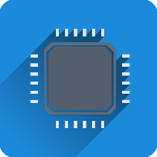
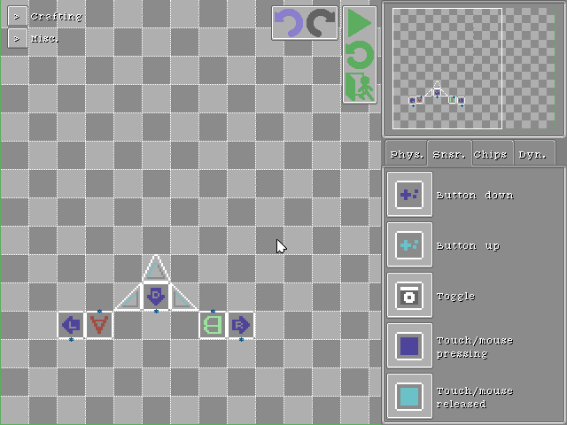
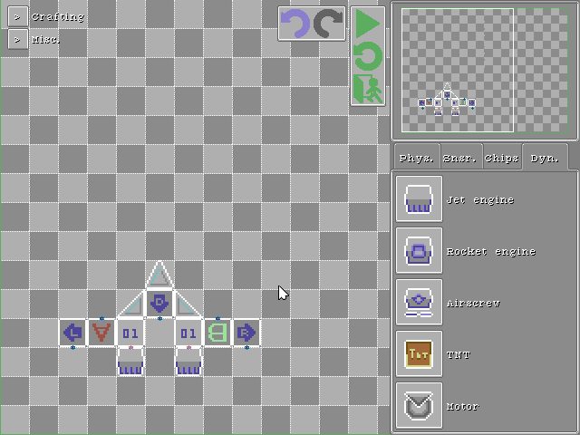
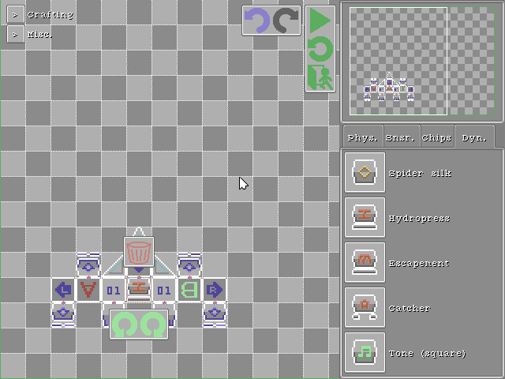
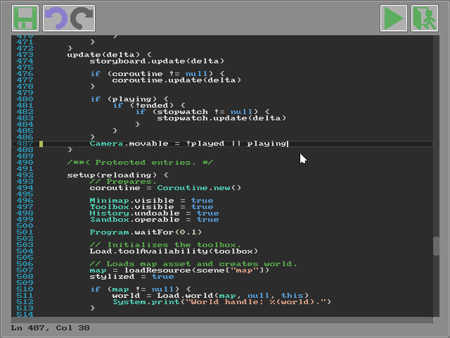
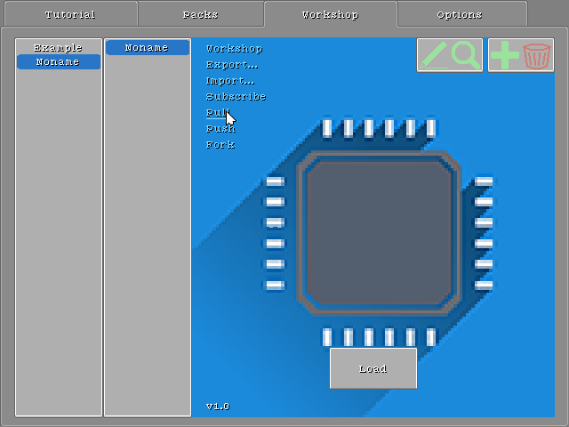

<head>
<link rel="shortcut icon" type="image/x-icon" href="favicon.ico">
</head>

## Crapht Box

[Manual](https://paladin-t.github.io/crft/docs/manual) |
[Slides](https://paladin-t.github.io/crft/docs/slides) |
[About](https://paladin-t.github.io/crft/pages/about)

**Get Crapht Box!**

TBD

<!--  -->

| FANTASY | PHYSICS SANDBOX |
|----|----|
|  | Crapht Box is a **Fantasy Physics Sandbox**,  inspired by the Fantasy Console genre.  It brings a simulated world with a number of  disks and tools, and leaves you to play,   program, create and share disks. |

### Technical specifications

* Display: scalable from 640x480
* Audio: 2 music channels, 4 sound effect channels, 1 speech channel
* Circuit clock: 60Hz
* Code: Wren, Lua
* Gamepad: 6 buttons (D-Pad + A/B)
* Keyboard and mouse: supported

## Crafting

Craft your machineries with physics, chip, sensor and dynamics elements.

## Programming

Program your own disks.

## Creating

Edit your scene with built-in tools.

## Sharing

Share your creativity with others.

### Get Crapht Box

TBD

<!--  -->

### System requirements

| | Minimum | Recommended |
|----|----|----|
| OS | Windows 7/8/10 (32/64bit) | Windows 7/8/10 (32/64bit) |
| CPU | Core 2 Duo 1.8GHz | Core i5 2.6GHz |
| RAM | 512MB | 2GB |
| GPU | Intel HD 4000 | Intel HD 6000 |

| Links | |
|----|----|
| Discuss | [Forums](https://steamcommunity.com/app/1227090/discussions/) |
| Twitter | [@wangrenxin](https://twitter.com/wangrenxin) |
