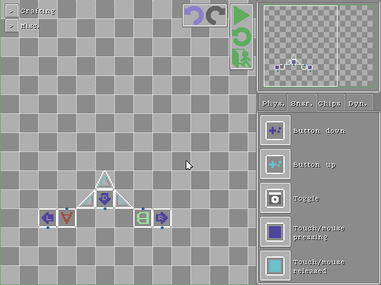
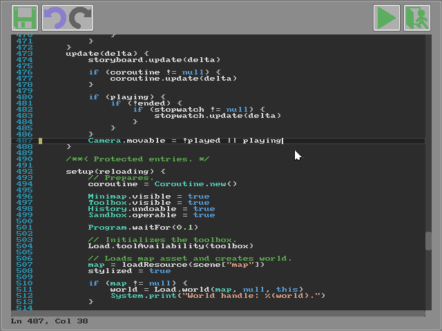
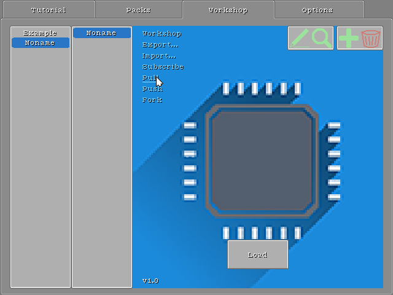

<head>
<link rel="shortcut icon" type="image/x-icon" href="favicon.ico">
</head>

## Crapht Box

[English](https://paladin-t.github.io/crft/)
[技术手册](https://paladin-t.github.io/crft/docs/manual_cn) |
[图示](https://paladin-t.github.io/crft/docs/slides_cn) |
[关于](https://paladin-t.github.io/crft/pages/about_cn)

**获取 Crapht Box!**

发售日期待定

<!--  -->

| 幻想 | 物理沙盒 |
|----|----|
|  | Crapht Box 是一个**幻想物理沙盒**，   灵感来源于幻想主机。   它模拟了一个物理环境并内置若干磁盘和工具，   现全权交付您游玩、编程、创造与分享。 |

### 技术规格

* 显示：可缩放（640x480 起）
* 声音：2 个音乐通道, 4 个音效通道, 1 个语音通道
* 电路时钟：60Hz
* 编程语言：Wren，Lua
* 手柄：6 键（方向键 + A/B）
* 键盘鼠标：支持

## 搭建

使用物理、芯片、传感器和动力元件搭建你的机器。

## 编程

通过编程创造你自己的磁盘。

## 创造

使用内置工具编辑你的场景。

## 分享

分享你的创意。

### 获取 Crapht Box

发售日期待定

<!--  -->

### 系统需求

| | 最低 | 推荐 |
|----|----|----|
| 操作系统 | Windows 7/8/10 (32/64bit) | Windows 7/8/10 (32/64bit) |
| CPU | Core 2 Duo 1.8GHz | Core i5 2.6GHz |
| 内存 | 512MB | 2GB |
| 显卡 | Intel HD 4000 | Intel HD 6000 |

| 链接 | |
|----|----|
| 讨论 | [论坛](https://steamcommunity.com/app/1227090/discussions/) |
| Twitter | [@wangrenxin](https://twitter.com/wangrenxin) |
