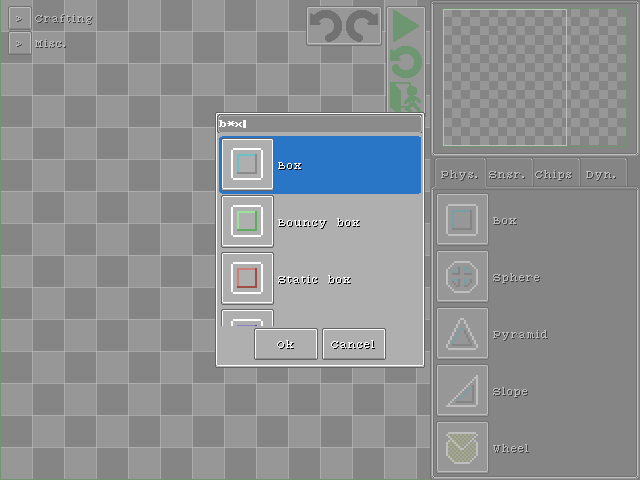

[English](https://paladin-t.github.io/crft/docs/elements) |
[首页](https://paladin-t.github.io/crft/README_cn)

按 `Ctrl`+`F` 以打开工具搜索栏，键入要寻找的元件名称以快速定位：

## 物理元件

| 名称 | 图标 |
|---|---|
| "phy/box" |  |
| "phy/sphere" |  |
| "phy/pyramid" |  |
| "phy/slope" |  |
| "phy/wheel" |  |
| "phy/focus" |  |
| "phy/bouncy_box" |  |
| "phy/bouncy_sphere" |  |
| "phy/bouncy_pyramid" |  |
| "phy/bouncy_slope" |  |
| "phy/static_box" |  |
| "phy/static_sphere" |  |
| "phy/static_pyramid" |  |
| "phy/static_slope" |  |
| "phy/iron_box" |  |
| "phy/iron_sphere" |  |
| "phy/iron_pyramid" |  |
| "phy/iron_slope" |  |

## 传感器元件

| 名称 | 图标 |
|---|---|
| "snsr/btn" |  |
| "snsr/btnp" |  |
| "snsr/toggle" |  |
| "snsr/touch" |  |
| "snsr/touchp" |  |
| "snsr/touch_relay" |  |
| "snsr/touchp_relay" |  |
| "snsr/cross_gate" |  |
| "snsr/contact_gate" |  |
| "snsr/gravity" |  |

## 芯片元件

| 名称 | 图标 |
|---|---|
| "chip/constant_byte" |  |
| "chip/constant_ascii" |  |
| "chip/randomizer_byte" |  |
| "chip/pulse" |  |
| "chip/register" |  |
| "chip/accumulator" |  |
| "chip/relay" |  |
| "chip/delay" |  |
| "chip/fuse" |  |
| "chip/trigger_edge" |  |
| "chip/trigger_difference" |  |
| "chip/wire_i" |  |
| "chip/wire_l" |  |
| "chip/wire_y" |  |
| "chip/wireless_sender" |  |
| "chip/wireless_receiver" |  |
| "chip/dot" |  |
| "chip/led" |  |
| "chip/ascii" |  |
| "chip/ssd" |  |
| "chip/decoder_num2ssd" |  |
| "chip/neg" |  |
| "chip/add" |  |
| "chip/sub" |  |
| "chip/mul" |  |
| "chip/div" |  |
| "chip/mod" |  |
| "chip/abs" |  |
| "chip/eq" |  |
| "chip/neq" |  |
| "chip/lt" |  |
| "chip/leq" |  |
| "chip/gt" |  |
| "chip/geq" |  |
| "chip/and" |  |
| "chip/or" |  |
| "chip/not" |  |
| "chip/xor" |  |
| "chip/band" |  |
| "chip/bor" |  |
| "chip/bnot" |  |
| "chip/bxor" |  |
| "chip/lshift" |  |
| "chip/rshift" |  |
| "chip/environment_now" |  |

## 动力元件

| 名称 | 图标 |
|---|---|
| "dyn/jet" |  |
| "dyn/rocket" |  |
| "dyn/airscrew" |  |
| "dyn/tnt" |  |
| "dyn/motor" |  |
| "dyn/crawler_belt" |  |
| "dyn/rifle" |  |
| "dyn/shotgun" |  |
| "dyn/flamethrower" |  |
| "dyn/laser" |  |
| "dyn/electromagnet" |  |
| "dyn/spider_silk" |  |
| "dyn/hydropress" |  |
| "dyn/escapement" |  |
| "dyn/catcher" |  |
| "dyn/tone_square" |  |
