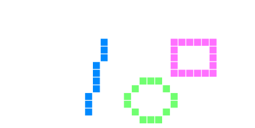
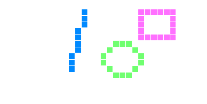

[简体中文](https://paladin-t.github.io/crft/docs/manual_cn) |
[Homepage](https://paladin-t.github.io/crft/)


## Welcome to Crapht Box

Crapht Box is a Fantasy Physics Sandbox, inspired by the Fantasy Console genre. It brings a simulated world with a number of disks and tools, and leaves you to play, program and share creations.

## Table of content

* [Part I. Fundamental](#part-i-fundamental)
	* [Operations](#operations)
	* [Capturing](#capturing)
		* [Screenshot](#screenshot)
		* [GIF](#gif)
	* [Specifications](#specifications)
	* [Disk structure](#disk-structure)

* [Part II. Crafting](#part-ii-crafting)
	* [Physics elements](#physics-elements)
	* [Sensor elements](#sensor-elements)
	* [Chip elements](#chip-elements)
	* [Dynamics elements](#dynamics-elements)

* [Part III. Programming](#part-iii-programming)
	* [Physics engine](#physics-engine)
	* [Syntax](#syntax)
		* [Wren](#wren)
		* [Lua](#lua)
	* [Directories](#directories)
	* [Coordinates](#coordinates)
	* [Basic](#basic)
		* [Basic module](#basic-module)
	* [Standard](#standard)
		* [Collection module](#collection-module)
		* [Coroutine module](#coroutine-module)
		* [Datetime module](#datetime-module)
		* [Image module](#image-module)
		* [IO module](#io-module)
		* [JSON module](#json-module)
		* [Keycode module](#keycode-module)
		<!-- * [Net module](#net-module) -->
		* [OS module](#os-module)
		* [Random module](#random-module)
		* [Web module](#web-module)
	* [Common](#common)
		* [Common module](#common-module)
	* [Elements](#elements)
		* [Physics module](#physics-module)
		<!-- * [Rope module](#rope-module) -->
		* [Particles module](#particles-module)
		* [Electronics module](#electronics-module)
		* [Sensor module](#sensor-module)
		* [Dynamics module](#dynamics-module)
		* [AI module](#ai-module)
		* [Alchemy module](#alchemy-module)
	* [Camera, boxes and history](#camera-boxes-and-history)
		* [Camera module](#camera-module)
		* [Minimap module](#minimap-module)
		* [Toolbox module](#toolbox-module)
		* [Sandbox module](#sandbox-module)
		* [History module](#history-module)
	* [GUI](#gui)
		* [GUI module](#gui-module)
		* [Layout module](#layout-module)
	* [Localization](#localization)
		* [Localization module](#localization-module)
		* [Dictionary module](#dictionary-module)
	* [Utilities](#utilities)
		* [Star module](#star-module)
		* [Prefab module](#prefab-module)
	* [Application](#application)
		* [Application module](#application-module)
	* [Program](#program)
		* [Program module](#program-module)
	* [In-disk](#in-disk)
		* [Disk module](#disk-module)

* [Part IV. Editors](#part-iv-editors)
	* [Code editor](#code-editor)
	* [Map editor](#map-editor)
	* [Level editor](#level-editor)
	* [Element editor](#element-editor)

* [Part V. Sharing](#part-v-sharing)
	* [Workshop](#workshop)
		* [Submitting](#submitting)
		* [Subscribing](#subscribing)
		* [Unsubscribing](#unsubscribing)
		* [Pushing](#pushing)
		* [Pulling](#pulling)
		* [Forking](#forking)
	* [Archiving](#archiving)
		* [Exporter and importer](#exporter-and-importer)

[HOME](#welcome-to-crapht-box)

# Part I. Fundamental

## Operations

Application:

* `LMB`: confirm
* `Enter`: confirm
* `Escape`: cancel
* `Y`/`N`: yes/no
* `Scroll wheel`: scroll

* `F1`: show this manual
* `F6`: take a screenshot
* `F7`: record frames for GIF
* `F8`: stop GIF recording
* `Alt`+`Enter`: toggle fullscreen
* `Alt`+`F4`: exit application

Home:

* `Space`: load a selected disk

Crafting:

* `LMB`: confirm operations; move camera; or placing, hold `Shift` for continuous placing
* `RMB`: select
* `Scroll wheel`: scroll/zoom

* `Ctrl`+`Z`/`Ctrl`+`Y`: undo/redo
* `Ctrl`+`H`: copy the history, hold `Shift` to escape double quotes
* `Ctrl`+`F`: open the tool search box
* `\`: hide the HUD
* `/`: show wireframes

* `Ctrl`+`A`: select all
* `Ctrl`+`C`: copy selection
* `Ctrl`+`X`: cut selection
* `Ctrl`+`V`: paste selection
* `Left`/`Right`/`Up`/`Down`: move selection, hold `Ctrl` for partial moving
* `Delete`: delete selection

## Capturing

### Screenshot

Press `F6` to take a screenshot, it prompts to save to your local storage.

### GIF

Press `F7` to record frames for GIF, press `F8` to stop GIF recording, it prompts to save to your local storage.

## Specifications

* Display: scalable from 640x480
* Audio: 2 music channels, 4 sound effect channels, 1 speech channel
* Circuit clock: 60Hz
* Code: Wren, Lua
* Gamepad: 6 buttons (D-Pad + A/B)
* Keyboard and mouse: supported

You can bind the gamepad buttons to keyboard or a gamepad device. The `Left`, `Right`, `Up`, `Down`, `A`, `B` are respectively binded to the `A`, `D`, `W`, `S`, `J`, `K` by default, you can change it in the `Option` tab.

## Disk structure

A typical disk comes with the following files under "`${disk}`/content":

| File | Note | Editing |
|---|---|---|
| "info.json" | Meta data of this disk | External text editors |
| "dictionary.json" | Localization data | External text editors |
| "storyboard.json" | Storyboard data, including speech, dialog text, element indicator, etc. | External text editors |
| "toolbox.json" | Availability data of the tools | External text editors |
| "scene.json" | Scene data, including map path, instantiated elements and prefabs | Built-in map/level/element editors |
| "map.map" | Map file | Open "scene.json" with built-in map editor |
| "disk.wren" | Disk-wise utilities | N/A |
| "main.wren" | Main source file | Built-in code editor, or external text editors |
| "main.palette" | Palette file | N/A |
| "sticker.png" | Disk sticker | Built-in capturing, or external image editors |

The meta data file "info.json" contains a number of fields that describe basic aspects of a disk. You might want to change some of it after creating a new disk. It can be loaded by `Load.diskInfo()` with module "disk". E.g.

```js
{
	"lang": 16,                  // 16 for Wren, 20 for Lua.
	"usage": 0,                  // Reserved, always set to 0 for now.
	"ugcid": 0,                  // 0 for common disk, otherwise with the Workshop ID of this disk.
	"uid": "00000000-0000-0000-0000-000000000000", // Reserved.
	"sticker": "sticker.png",    // The sticker image.
	"title": {                   // The display title in different languages.
		"english": "Noname",
		"chinese": "未命名"
	},
	"description": "",           // The description on the Workshop web page.
	"author": "Anonymous",       // Your name here.
	"version": "1.0",            // The version number.
	"genre": "ANY",              // Reserved.
	"email": "",                 // Reserved.
	"url": "",                   // Reserved.
	"creation": 0,               // Reserved.
	"controls": [ ],             // Reserved.
	"entries": {                 // The entry file path.
		"main": "main.wren",
		"editor": ""
	},
	"bundle": {                  // The bundle name in different languages.
		"english": "Noname",
		"chinese": "未命名"
	},
	"priority": 100,             // A integer which controls display orders of disks.
	"locked": false              // You have to pass previous levels before unlocking
	                             // this one with `true`, or ready to play with `false`.
}
```

The "dictionary.json" contains text information for runtime lookup. It can be loaded by the `Dictionary` class in module "dictionary". E.g.

```js
{
	"english": {
		"greeting": "Ahoy!",

		"stars": "Missions",
		"stars/goal/tips": "Reach the goal",
		"stars/defeat/tips": "Defeat the enemies",
		"stars/time/tips": "Complete in 90s"
	},
	"chinese": {
		"greeting": "嗨！",

		"stars": "任务",
		"stars/goal/tips": "到达目标点",
		"stars/defeat/tips": "打败敌人",
		"stars/time/tips": "在 90 秒内通关"
	}
}
```

The "storyboard.json" can be loaded by the `Storyboard` class in module "disk". E.g.

```js
{
	"storyboard": {
		"load": [
			{
				"type": "chat",
				"text": "greeting"
			},
			{
				"type": "say",
				"text": "ahoy."
			}
		]
	}
}
```

The "toolbox.json" can be loaded by `Load.toolAvailability(...)` with module "disk". E.g.

```js
{
	"availability": [
		{
			"category": "*",
			"name": "*",
			"value": true
		}
	]
}
```

The "scene.json" can be loaded by `Load.sceneGraph(...)` with module "disk". E.g.

```js
{
	"map": "map.map",
	"toolbox": [
	],
	"prefab": [
		{
			"type": "create",
			"category": "prefab",
			"name": "goal_text",
			"position": [
				42.5, 2.5
			],
			"rotation": [
				0, 1
			],
			"tag": "goal"
		}
	]
}
```

[HOME](#welcome-to-crapht-box)

# Part II. Crafting

There are four element categories in the crafting toolbox.

## Physics elements

The physics category contains regular rigid bodies in a few shapes. It is the simplest structure in Crapht Box that does not conduct anything in a circuit, but it does work as framework in the physical scene. See [physics elements](https://paladin-t.github.io/crft/docs/elements#physics-elements) for items. See tooltips in application for details.

## Sensor elements

The sensor category contains gamepad input, mouse/touch input, in-scene interactable sensors, etc. Sensor can be used as signal source in a circuit. See [sensor elements](https://paladin-t.github.io/crft/docs/elements#sensor-elements) for items. See tooltips in application for details.

## Chip elements

The chip category contains signal producers, conductors, mappers, consumers, etc. Chip can be used as signal source, intermediate node or output reactor in a circuit. See [chip elements](https://paladin-t.github.io/crft/docs/elements#chip-elements) for items. See tooltips in application for details.

## Dynamics elements

The dynamics category contains power sources, weapons, etc. Dynamics can be used as output reactor in a circuit. See [dynamics elements](https://paladin-t.github.io/crft/docs/elements#dynamics-elements) for items. See tooltips in application for details.

[HOME](#welcome-to-crapht-box)

# Part III. Programming

## Physics engine

Crapht Box uses the [Box2D](http://box2d.org/) engine for physics simulation.

## Syntax

### Wren

Disk in Crapht Box is mainly programmed in the [Wren](http://wren.io/) programming language.

### Lua

_Experimental: It is also possible to program in the [Lua](http://www.lua.org/) programming language, using the [B95](https://github.com/paladin-t/b95) compiler implemented in Wren._

**Importing**

```dart
import "compiler/lua" for Lua
```

**Class `Lua`**

* `construct new()`: constructs a Lua compiler
* `construct new(raise)`: constructs a Lua compiler
	* `raise`: the error raiser, defaults to `Fiber.abort`
* `construct new(raise, options)`: constructs a Lua compiler
	* `raise`: the error raiser, defaults to `Fiber.abort`
	* `options`: a map of options, with range of values in the following table

| Key of `options` | Value | Note |
|---|---|---|
| `"constructor"` | `"new"`, `"ctor"` | Always use `"ctor"` in Crapht Box |

* `compile(code)`: compiles Lua code to Wren
	* `code`: the source in Lua
	* returns the compiled code object

<!-- * `compile(code, debug)`: compiles Lua code to Wren
	* `code`: the source in Lua
	* `debug`: whether generates debug information
	* returns the compiled code object
-->

E.g.

```dart
import "b95" for Lua

var lua = Lua.new()
var code = lua.compile("print(22 / 7)")
System.print(code.toString)
```

Subscribe to the "[Lua Loader](https://steamcommunity.com/sharedfiles/filedetails/?id=1984358157)" (ID: 1984358157) for details.

## Directories

All data and editable disks are stored in a library directory on local storage. The root path of `${Documents}` is:

* "C:/Users/YourName/Documents/Crapht Box/" on Windows

<!-- * "/Users/YourName/Documents/Crapht Box/" on MacOS
* "/home/YourName/Documents/Crapht Box/" on Linux
-->

Lookup priorities for `import`:

| Priority | Directory | Note |
|---|---|---|
| 1 | Built-in | For `Meta`, `Random` |
| 2 | "`${disk}`/content/" | `${disk}` is the current running one |
| 3 | "`${app}`/shell/content/" | |
| 4 | Falls to reading/writing solvers | |

Reading/writing solvers for IO accessing:

| Prefix | Directory | Note |
|---|---|---|
| "app://" | "./" | The current working directory |
| "disk://" | "`${disk}`/" | `${disk}` is the current running one |
| "doc://" | "`${Documents}`/" | |
| - | - | Can be relative or absolute path |

## Coordinates

Crapht Box implements two kinds of coordinate systems. The first one starts from the top-left corner for graphics primitives, GUI overlays, etc. and the second one starts from the bottom-left corner for in-scene objects.

Screen space:



World space:



Besides, there's another local space which is similar to the world space, but the axises rotate along with an element itself.

## Basic

### Basic module

Crapht Box runs on top of a [BASIC](https://paladin-t.github.io/b8/) system. This module contains wrappers to communicate to it.

**Importing**

```dart
import "basic" for Basic, Terminal, Resource
```

**Class `Basic`**

* **static** `callRoutine(func [, ...])`: calls a BASIC function
	* `func`: the function name to be called
	* `...`: optional variadic
	* returns optional return value from BASIC

* **static** `retainValue(name, val)`: retains a BASIC value to prevent from collected by the GC
	* `name`: a custom name for the value
	* `val`: the value to be retained
	* returns `true` for success, otherwise `false`
* **static** `releaseValue(name)`: releases a BASIC value to give up retainment by Wren
	* `val`: the value to be released
	* returns `true` for success, otherwise `false`

* **static** `clip(x, y, w, h)`: sets clip state in screen space
* **static** `clip()`: resets clip state
* **static** `text(x, y, txt, col)`: draws an ASCII text in screen space, same as `text(x, y, txt, col, false)`
	* `col`: `Color`
* **static** `text(x, y, txt, col, isutf)`: draws an ASCII or UTF text in screen space
	* `col`: `Color`
	* `isutf`: `true` for UTF text, otherwise for ASCII; UTF `String` is cached until ejecting a disk, so it's recommended to use ASCII for frequently changing text, e.g. FPS, RAM stat. etc. only set this parameter to `true` for relatively static text when you really need
* **static** `plot(x, y, col)`: draws a point in screen space
	* `col`: `Color`
* **static** `line(x0, y0, x1, y1, w, col)`: draws a line in screen space
	* `w`: the line width
	* `col`: `Color`
* **static** `circ(x, y, r, col)`: draws a circle in screen space
	* `r`: the radius
	* `col`: `Color`
* **static** `circfill(x, y, r, col)`: fills a circle in screen space
	* `r`: the radius
	* `col`: `Color`
* **static** `ellipse(x, y, rx, ry, col)`: draws an ellipse in screen space
	* `rx`: the radius in the x axis
	* `ry`: the radius in the y axis
	* `col`: `Color`
* **static** `ellipsefill(x, y, rx, ry, col)`: fills an ellipse in screen space
	* `rx`: the radius in the x axis
	* `ry`: the radius in the y axis
	* `col`: `Color`
* **static** `arc(x, y, r, sa, ea, pie, col)`: draws an arc/bow in screen space
	* `r`: the radius
	* `sa`: start angle
	* `ea`: end angle
	* `pie`: `true` for pie shape
	* `col`: `Color`
* **static** `arcfill(x, y, r, sa, ea, pie, col)`: fills a bow in screen space
	* `r`: the radius
	* `sa`: start angle
	* `ea`: end angle
	* `pie`: `true` for pie shape
	* `col`: `Color`
* **static** `rect(x0, y0, x1, y1, col)`: draws a rectangle in screen space
	* `col`: `Color`
* **static** `rectfill(x0, y0, x1, y1, col)`: fills a rectangle in screen space
	* `col`: `Color`

* **static** `sget(sprite, x, y [, frame])`: gets a palette index at a specific position of a sprite
	* `frame`: the frame index, defaults to 0
	* returns the palette index
* **static** `sset(sprite, x, y, val [, frame])`: sets a palette index to a specific position of a sprite
	* `frame`: the frame index, defaults to 0
* **static** `mget(map, x, y [, layer])`: gets a tile index at a specific position of a map
	* `layer`: the map layer index, defaults to 0
	* returns the tile index
* **static** `mset(map, x, y, val [, layer])`: sets a tile index to a specific position of a map
	* `layer`: the map layer index, defaults to 0
* **static** `iget(quantized, x, y)`: gets a palette index at a specific position of a quantized image
	* returns the palette index
* **static** `iset(quantized, x, y, val)`: sets a palette index to a specific position of a quantized image
* **static** `tget(truecolor, x, y)`: gets a color value at a specific position of a true color image
	* returns the color value
* **static** `tset(truecolor, x, y, val)`: sets a color value to a specific position of a true color image

* **static** `btn(k)`: gets whether a specific key on the virtual gamepad is pressed
	* `k`: the specific key, can be `KeyCode.GamepadLeft`, `KeyCode.GamepadRight`, `KeyCode.GamepadUp`, `KeyCode.GamepadDown`, `KeyCode.GamepadA` or `KeyCode.GamepadB`
	* returns `true` for pressed, otherwise `false`
* **static** `btnp(k)`: gets whether a specific key on the virtual gamepad is just released from pressing
	* `k`: the specific key, can be `KeyCode.GamepadLeft`, `KeyCode.GamepadRight`, `KeyCode.GamepadUp`, `KeyCode.GamepadDown`, `KeyCode.GamepadA` or `KeyCode.GamepadB`
	* returns `true` for released, otherwise `false`
* **static** `key(k)`: gets whether a specific key on the keyboard is pressed
	* `k`: the specific key, can be one of the keyboard values of the `KeyCode` class in module "keycode"
	* returns `true` for pressed, otherwise `false`
* **static** `keyp(k)`: gets whether a specific key on the keyboard is just released from pressing
	* `k`: the specific key, can be one of the keyboard values of the `KeyCode` class in module "keycode"
	* returns `true` for released, otherwise `false
* **static** `touch()`: gets whether the left mouse button is pressed
	* returns `Vec2` for the pressing position, otherwise `null`
* **static** `touch(k)`: gets whether a specific mouse button is pressed
	* `k`: the specific key, can be `KeyCode.MouseLeft`, `KeyCode.MouseMiddle` or `KeyCode.MouseRight`
	* returns `Vec2` for the pressing position, otherwise `null`
* **static** `touchp()`: gets whether the left mouse button is just released from pressing
	* returns `Vec2` for the releasing position, otherwise `null`
* **static** `touchp(k)`: gets whether a specific mouse button is just released from pressing
	* `k`: the specific key, can be `KeyCode.MouseLeft`, `KeyCode.MouseMiddle` or `KeyCode.MouseRight`
	* returns `Vec2` for the releasing position, otherwise `null`
* **static** `touchm()`: gets the current mouse position
	* returns `Vec2` for the valid position, otherwise `null`

* **static** `play(seq, channel, preset, loop)`: plays an [MML](https://en.wikipedia.org/wiki/Music_Macro_Language) (Music Macro Language) `String`; use `Basic.play("P", ch)` to stop music at a specific channel, or use the following `stop` instead
	* `seq`: the MML format `String`
	* `channel`: the channel to play with
	* `preset`: the preset index in the sound font
	* `loop`: `true` for loop, otherwise `false`
* **static** `stop(channel)`: stops music started by `play`
	* `channel`: the channel to stop

The tones are indicated by letters `A` through `G`. Accidentals are indicated with a `+` or `#` (for sharp) or `-` (for flat) immediately after the note letter. See this example:

```dart
Basic.play("C C# C C#")
```

Whitespaces are ignored inside the string expression. There are also codes that set the duration, octave and tempo. They are all case-insensitive. `play` executes the commands or notes the order in which they appear in the string. Any indicators that change the properties are effective for the notes following that indicator.

```
Ln     Sets the duration (length) of the notes. The variable n does not indicate an actual duration
       amount but rather a note type; L1 - whole note, L2 - half note, L4 - quarter note, etc.
       (L8, L16, L32, L64, ...). By default, n = 4.
       For triplets and quintets, use L3, L6, L12, ... and L5, L10, L20, ... series respectively.
       The shorthand notation of length is also provided for a note. E.g. "L4 CDE L8 FG L4 AB"
       can be shortened to "L4 CDE F8G8 AB". F and G play as eighth notes while others play as quarter notes.
On     Sets the current octave. Valid values for n are 0 through 6. An octave begins with C and ends with B.
       Remember that C- is equivalent to B. 
< >    Changes the current octave respectively down or up one level.
Nn     Plays a specified note in the seven-octave range. Valid values are from 0 to 84. (0 is a pause).
       Cannot use with sharp and flat. Cannot use with the shorthand notation neither.
MN     Stand for Music Normal. Note duration is 7/8ths of the length indicated by Ln. It is the default mode.
ML     Stand for Music Legato. Note duration is full length of that indicated by Ln.
MS     Stand for Music Staccato. Note duration is 3/4ths of the length indicated by Ln.
Pn     Causes a silence (pause) for the length of note indicated (same as Ln). 
Tn     Sets the number of "L4"s per minute (tempo). Valid values are from 32 to 255. The default value is T120. 
.      When placed after a note, it causes the duration of the note to be 3/2 of the set duration.
       This is how to get "dotted" notes. "L4 C#." would play C sharp as a dotted quarter note.
       It can be used for a pause as well.
```

* **static** `say(words [, speed, pitch, throat, mouth])`: synthesises speech
	* `words`: the text `String` to synthesise
	* `speed`: with range of values from 0 to 255, defaults to 72
	* `pitch`: with range of values from 0 to 255, defaults to 64
	* `throat`: with range of values from 0 to 255, defaults to 128
	* `mouth`: with range of values from 0 to 255, defaults to 128

**Class `Terminal`**

* **static** `show()`: shows the terminal
* **static** `hide()`: hides the terminal

* **static** `write(t)`: writes something to the terminal
	* `t`: the text to write
* **static** `write(t, c)`: writes something to the terminal in a specific color
	* `t`: the text to write
	* `c`: `Color`
* **static** `write(t, r, g, b, a)`: writes something to the terminal in a specific color
	* `t`: the text to write
* **static** `writeLine(t)`: writes something to the terminal with a following newline
	* `t`: the text to write
* **static** `writeLine(t, c)`: writes something to the terminal with a following newline in a specific color
	* `t`: the text to write
	* `c`: `Color`
* **static** `writeLine(t, r, g, b, a)`: writes something to the terminal with a following newline in a specific color
	* `t`: the text to write
* **static** `backspace()`: deletes a character backward
* **static** `deleteLine()`: deletes a line
* **static** `clear()`: clears the terminal

**Class `Resource`**

* `construct load(path)`: constructs a `Resource` by loading from file, same as `construct load(path, false)`
	* `path`: the file path to load
* `construct load(path, isrel)`: constructs a `Resource` by loading from file
	* `path`: the file path to load
	* `isrel`: `true` for relative path, otherwise for absolute; can use shurtcut prefixes (`"app://"`, `"disk://"`, `"doc://"`) if set to `false`
* `construct load(type, width, height)`: constructs a `Resource` by loading a blank data
	* `path`: can be `"sprite"`, `"map"`, `"quantized"`
* `construct load(type, width, height, n)`: constructs a `Resource` by loading a blank data
	* `path`: can be `"sprite"`, `"map"`, `"quantized"`
* `unload()`: unloads this resource

* `count`: gets the frame count

* `width`: gets the width of any frame
* `height`: gets the height of any frame

## Standard

### Collection module

**Importing**

```dart
import "collection" for Stack, Mapper
```

**Class `Stack`**

[Stack](https://simple.wikipedia.org/wiki/Stack_(data_structure)) is a kind of LIFO data structure.

* `construct new()`: constructs a `Stack`
* `construct new(threshold)`: constructs a `Stack` with a specific capacity threshold
	* `threshold`: the capacity threshold

* `isEmpty`: gets whether this stack is empty
	* returns `true` for empty, otherwise `false`

* `peek`: gets the top element in this stack
	* returns the top element in this stack

* `push(val)`: pushes a value to the top of this stack
	* `val`: the specific value to push
* `pop()`: pops a value from the top of this stack
	* returns the popped element from this stack

**Class `Mapper`**

* **static** `merge(...)`: merges a number of Wren `Map`s into a new one, latter entries override former
	* `...`: the specific `Map`s
	* returns the merged `Map`

* **static** `mustBe(obj, k)`: gets the value corresponding to a specific key in a `Map`, raises an error if not found
	* `obj`: the `Map` object
	* `k`: the specific key
	* returns the corresponding value, or
	* throws error
* **static** `mayBe(obj, k, fall)`: gets the value corresponding to a specific key in a `Map`, returns an alternative if not found
	* `obj`: the `Map` object
	* `k`: the specific key
	* `fall`: the alternative value
	* returns the corresponding value, or `fall`

### Coroutine module

**Importing**

```dart
import "coroutine" for Coroutine
```

**Class `Coroutine`**

[Coroutine](https://en.wikipedia.org/wiki/Coroutine) can suspend their execution and allows re-entry at multiple entry points. This `Coroutine` dispatcher accepts and manages Wren `Fiber` and updates them at a specific time point, just acts similar to the Unity3D's.

* `construct new()`: constructs a `Coroutine` dispatcher

* `isEmpty`: gets whether there's no alive coroutine in this dispatcher
	* returns `true` for empty, otherwise `false`

* `clear()`: clears all coroutines
* `start(co [, ...])`: starts a coroutine with optional arguments
	* `co`: `Fn`/`Fiber`
	* `...`: the option arguments

* `update(delta)`: updates through all fibers of this dispatcher; this function is often called in a `Program`-wise `update` procedure
	* `delta`: the elapsed time in seconds since last updating

### Datetime module

**Importing**

```dart
import "datetime" for DateTime
```

**Class `DateTime`**

* **static** `ticks`: gets ticks in seconds since startup; similar to Wren's `System.clock` but do not mix them together for time counting
	* returns the wall clock independent ticks in seconds since startup

* **static** `now`: gets current data
	* returns a `List` of `Num`s respectively for year, month, day, hour, minute and second

### Image module

**Importing**

```dart
import "image" for Image
```

**Class `Image`**

* `construct new()`: constructs an image object

* `[x, y]`: gets the color value at a specific position
	* returns the color value
* `[x, y] = (col)`: sets the color value to a specific position

* `width`: gets the width in pixels
* `height`: gets the height in pixels

* `resize(w, h)`: resizes this image object
	* returns `true` for success, otherwise `false`

* `load(w, h)`: loads from blank data with a specific size
	* returns `true` for success, otherwise `false`
* `load(path)`: loads from a file
	* returns `true` for success, otherwise `false`
* `save(path)`: saves to a file
	* returns `true` for success, otherwise `false`

### IO module

**Importing**

```dart
import "io" for Path, File, FileInfo, DirectoryInfo
```

**Class `Path`**

* **static** `absoluteOf(path)`: gets the absolute path of a path `String`
	* `path`: the path `String`
	* returns the absolute path

* **static** `parentOf(path)`: gets the parent path of a path `String`
	* `path`: the path `String`
	* returns the parent path `String`
* **static** `nameOf(path)`: gets the name of a path `String`
	* `path`: the path `String`
	* returns the name `String`
* **static** `extensionOf(path)`: gets the extension of a path `String`
	* `path`: the path `String`
	* returns the extension `String`

* **static** `split(path)`: splits a path `String` into parts
	* `path`: the path `String`
	* returns the splitted result as a `List` of the parent, name and extension `String`
* **static** `concat(patha, pathb)`: concatenates path parts into one `String`
	* `patha`: the first path `String`
	* `pathb`: the second `String`
	* returns the concatenated path `String`

* **static** `exists(path)`: checks whether a specific path exists as either file or directory
	* `path`: the path `String`
	* returns `true` for exists, otherwise `false`
* **static** `move(path, target)`: moves a file or directory to somewhere else, use this to rename something as well
	* `path`: the source path `String`
	* `target`: the target path `String`
	* returns `true` for success, otherwise `false`
* **static** `copy(path, target)`: copies a file or directory to somewhere else
	* `path`: the source path `String`
	* `target`: the target path `String`
	* returns `true` for success, otherwise `false`
* **static** `remove(path [, toTrashBin])`: removes a file or directory from local storage
	* `path`: the path `String`
	* `toTrashBin`: whether removes to the trash bin, defaults to `true`
	* returns `true` for success, otherwise `false`

* **static** `createFile(path)`: creates a file at a specific path
	* `path`: the path `String`
	* returns `true` for success, otherwise `false`
* **static** `createDirectory(path)`: creates a directory at a specific path
	* `path`: the path `String`
	* returns `true` for success, otherwise `false`

* **static** `getFiles(path, pattern [, recursive])`: gets all files under a specific directory
	* `path`: the path `String`
	* `pattern`: the searching pattern, e.g. `"*"`, `"*.json"`, `"*_data_??.txt"`
	* `recursive`: whether searches recursively, defaults to `false`
	* returns the matched files as a `List` of path `String`
* **static** `getDirectories(path [, recursive])`: gets all directories under a specific directory
	* `path`: the path `String`
	* `pattern`: the searching pattern, e.g. `"*"`, `"*saved*"`
	* `recursive`: whether searches recursively, defaults to `false`
	* returns the matched directories as a `List` of path `String`

* **static** `explore(path)`: explores to a specific path with the file explorer on your computer
	* `path`: the path `String`

**Class `File`**

* `construct new()`: constructs a `File` object

* `open(path [, write])`: opens a specific file path
	* `path`: the file path
	* `write`: defaults to `false`
	* returns `true` for success, otherwise `false`
* `close()`: closes this file
	* returns `true` for success, otherwise `false`

* `length`: gets the length in bytes of this file
* `endOfStream`: gets whether the IO cursor is at the end of this file
	* returns `true` for end of file, otherwise `false`

* `peek`: gets the IO cursor
	* returns the IO cursor
* `poke(pos)`: sets the IO cursor to a specific position
	* `pos`: the expected IO cursor

* `readAll()`: reads all content in this file as `String` and moves the IO cursor
	* returns the read `String`
* `read()`: read a byte `Num` and moves the IO cursor
	* returns the read byte `Num`
* `readU8()`: read a byte `Num` and moves the IO cursor
	* returns the read byte `Num`
* `readI32()`: read a 32bit integer `Num` and moves the IO cursor
	* returns the read 32bit integer `Num`
* `readFloat()`: reads an IEEE-754 single float `Num` and moves the IO cursor
	* returns the read single float `Num`
* `readString(length)`: reads a specific length of bytes as `String` and moves the IO cursor
	* `length`: the expected reading length
	* returns the read `String`
* `readLine()`: read a line of `String` and moves the IO cursor
	* returns the read `String`
* `readBytes()`: reads all content in this file as a `List` of bytes and moves the IO cursor
	* returns the read `List` of bytes

* `write(data)`: writes a byte `Num` and moves the IO cursor
	* `data`: the byte `Num` to write
* `writeU8(data)`: writes a byte `Num` and moves the IO cursor
	* `data`: the byte `Num` to write
* `writeI32(data)`: writes a 32bit integer `Num` and moves the IO cursor
	* `data`: the 32bit integer `Num` to write
* `writeFloat(data)`: writes an IEEE-754 single float `Num` and moves the IO cursor
	* `data`: the single float `Num` to write
* `writeString(data)`: writes a `String` without ending `'\0'` and moves the IO cursor
	* `data`: the `String` to write
* `writeLine(data)`: writes a `String` with newline but without ending `'\0'` and moves the IO cursor
	* `data`: the `String` to write
* `writeBytes(data)`: writes a `List` of bytes and moves the IO cursor
	* `data`: the `List` of bytes to write

**Class `FileInfo`**

* `construct new(path)`: constructs a file information object
	* `path`: the specific file path

* `isEmpty`: gets whether this file is empty
	* returns `true` for empty, otherwise `false`

* `fullName`: gets the full path
* `parentName`: gets the parent directory name
* `name`: gets the file name
* `extension`: gets the extension name

* `exists`: gets whether this file exists on local storage
	* returns `true` for exists, otherwise `false`
* `create()`: creates this file onto local storage if it doesn't exist yet
	* returns `true` for success, otherwise `false`
* `remove([toTrashBin])`: removes this file from local storage
	* `toTrashBin`: whether removes to the trash bin, defaults to `true`
	* returns `true` for success, otherwise `false`
* `moveTo(target)`: moves this file to somewhere else
	* `target`: the target path `String`
	* returns `true` for success, otherwise `false`
* `copyTo(target)`: copies this file to somewhere else
	* `target`: the target path `String`
	* returns `true` for success, otherwise `false`

* `readAll()`: reads all content in this file as `String`
	* returns the read `String`

* `parent`: gets the parent directory information object of this file
	* returns the parent `DirectoryInfo` of this file

**Class `DirectoryInfo`**

* `construct new(path)`: constructs a directory information object
	* `path`: the specific directory path

* `isEmpty`: gets whether this directory is empty
	* returns `true` for empty, otherwise `false`

* `fullName`: gets the full path
* `parentName`: gets the parent directory name
* `name`: gets the directory name

* `exists`: gets whether this directory exists on local storage
	* returns `true` for exists, otherwise `false`
* `create()`: creates this directory onto local storage if it doesn't exist yet
	* returns `true` for success, otherwise `false`
* `remove([toTrashBin])`: removes this directory from local storage
	* `toTrashBin`: whether removes to the trash bin, defaults to `true`
	* returns `true` for success, otherwise `false`
* `moveTo(target)`: moves this directory to somewhere else
	* `target`: the target path `String`
	* returns `true` for success, otherwise `false`
* `copyTo(target)`: copies this directory to somewhere else
	* `target`: the target path `String`
	* returns `true` for success, otherwise `false`

* `getFiles(pattern [, recursive])`: gets all files under this directory
	* `pattern`: the searching pattern, e.g. `"*"`, `"*.json"`, `"*_data_??.txt"`
	* `recursive`: whether searches recursively, defaults to `false`
	* returns the matched files as a `List` of path `String`
* `getDirectories([recursive])`: gets all sub directories under this directory
	* `pattern`: the searching pattern, e.g. `"*"`, `"*saved*"`
	* `recursive`: whether searches recursively, defaults to `false`
	* returns the matched directories as a `List` of path `String`

* `parent`: gets the parent directory information object of this directory
	* returns the parent `DirectoryInfo` of this directory

### JSON module

**Importing**

```dart
import "json" for Json
```

**Class `Json`**

<!--
* **static** `OrderedKey`: the helper key constant in a JSON object which only tells the order
-->

<!--
* **static** `tokenize(string)`: gets a `List` of tokens of a JSON `String`
-->

* **static** `parse(string [, ordered])`: parses a JSON `String` to Wren object
	* `string`: the JSON `String` to parse
	* `ordered`: whether keeps the order of the original JSON, defaults to `false`
	* returns the parsed Wren object

* **static** `stringify(object [, compact])`: stringfies a Wren object to JSON `String`
	* `object`: the Wren object to stringify
	* `compact`: whether compacts the stringfied `String`, defaults to `false`
	* returns the stringfied `String`

### Keycode module

**Importing**

```dart
import "keycode" for KeyCode
```

**Class `KeyCode`**

This class contains constants for mouse, gamepad and keyboard keys, the names quite tell what they are.

* **static** `MouseLeft`
* **static** `MouseMiddle`
* **static** `MouseRight`

* **static** `GamepadLeft`
* **static** `GamepadRight`
* **static** `GamepadUp`
* **static** `GamepadDown`
* **static** `GamepadA`
* **static** `GamepadB`

* **static** `Return`
* **static** `Esc`
* **static** `Backspace`
* **static** `Tab`
* **static** `Space`

* **static** `A`~`Z`

* **static** `Num0`~`Num9`

* **static** `F1`~`F12`

* ...

See "`${app}`/shell/content/keycode.wren" for more.

<!--
### Net module

**Importing**

```dart
import "net" for Net
```

**Class `Net`**

* `construct new()`: constructs a `Net` object

* `[key]`: gets the option value of a specific key
* `[key] = (value)`: sets the option value of a specific key

* `id`: gets the ID of this object

* `open(addr)`: opens a network connection
* `close()`: closes this network connection

* `send(data)`: sends specific data via network
* `broadcast(data)`: broadcast specific data via network
* `broadcast(data, exclude)`: broadcast specific data via network
-->

### OS module

**Importing**

```dart
import "os" for Os
```

**Class `Os`**

* **static** `info`: gets the current OS information, including name and version

* **static** `clipboardText`: gets the text in the clipboard
* **static** `clipboardText = (txt)`: sets a text to the clipboard

### Random module

**Importing**

```dart
import "random" for Random
```

**Class `Random`**

See [`Random`](http://wren.io/modules/random/random.html) for details.

### Web module

**Importing**

```dart
import "web" for Web
```

**Class `Web`**

* **static** `surf(url)`: navigates to a specific URL with browser

* **static** `request(url [, method [, field]])`: performs an HTTP request
	* `url`: the URL to request
	* `method`: the request method, can be `"get"` or `"post"`, defaults to `"get"`
	* `field`: the fields for post, defaults to `null`

## Common

### Common module

**Importing**

```dart
import "common" for Direction, Component, Group, Vec2, Vec3, Vec4, Rect, Rot, Color, Handle
```

**Class `Direction`**

* **static** `Left`
* **static** `Right`
* **static** `Up`
* **static** `Down`
* **static** `Any`

**Class `Component`**

* **static** `None`
* **static** `Fixture`
* **static** `Joint`
* **static** `Conduction`
* **static** `Particle`
* **static** `Contact`
* **static** `Target`
* **static** `All`: composited by all above

**Class `Group`**

* **static** `Void`
* **static** `Environment`
* **static** `Player`
* **static** `Ai`
* **static** `All`: composited by all above

**Class `Vec2`**

* `construct new()`: constructs a `Vec2` value
* `construct new(x, y)`: constructs a `Vec2` value
	* `x`: the x component
	* `y`: the y component

* `toString`: gets the `String` representation of the value

* `x`: gets the x component
* `x = (value)`: sets the x component
* `y`: gets the y component
* `y = (value)`: sets the component

* `-`: gets the component-wise negative value of this value
* `+ (other)`: gets the component-wise sum value of this and another value
	* `other`: `Vec2`
* `- (other)`: gets the component-wise difference value of this and another value
	* `other`: `Vec2`
* `* (other)`: gets the component-wise product value of this value and another `Num`
	* `other`: `Num`

* `normalize()`: normalizes this value
* `normalized`: gets the normalized value of this value
	* returns `Vec2`

* `length`: gets the length of this value
	* returns `Num`
* `lengthSquared`: gets the square of the length of this value
	* returns `Num`

* `distance(other)`: gets the distance between this and another value
	* `other`: `Vec2`
	* returns `Num`
* `distanceSquared(other)`: gets the square of the distance between this and another value
	* `other`: `Vec2`
	* returns `Num`

* `dot(other)`: gets the dot product of this and another value
	* `other`: `Vec2`
	* returns `Num`
* `cross(other)`: gets the cross product of this and another value or `Num`
	* `other`: `Vec2`/`Num`
	* returns `Num`/`Vec2`

* `angle()`: gets the angle from the x+ axis to this value
	* returns `Num`
* `angle(other)`: gets the angle from this value to another
	* `other`: `Vec2`
	* returns `Num`
* `rotated(angle)`: gets the rotated `Vec2` of this value around the origin by a specific angle
	* `other`: `Vec2`
	* returns `Vec2`
* `rotated(angle, pivot)`: gets the rotated `Vec2` of this value around a specific pivot by a specific angle
	* `angle`: `Num`
	* `pivot`: `Vec2`
	* returns `Vec2`

**Class `Vec3`**

* `construct new()`: constructs a `Vec3` value
* `construct new(x, y, z)`: constructs a `Vec3` value
	* `x`: the x component
	* `y`: the y component
	* `z`: the z component

* `toString`: gets the `String` representation of this value

* `x`: gets the x component
* `x = (value)`: sets the x component
* `y`: gets the y component
* `y = (value)`: sets the y component
* `z`: gets the z component
* `z = (value)`: sets the z component

* `-`: gets the component-wise negative value of this value
* `+ (other)`: gets the component-wise sum value of this and another value
	* `other`: `Vec3`
* `- (other)`: gets the component-wise difference value of this and another value
	* `other`: `Vec3`
* `* (other)`: gets the component-wise product value of this and another value
	* `other`: `Num`

* `normalize()`: normalizes this value
* `normalized`: gets the normalized value of this value
	* returns `Vec3`

* `length`: gets the length of this value
	* returns `Num`
* `lengthSquared`: gets the square of the length of this value
	* returns `Num`

* `distance(other)`: gets the distance between this and another value
	* `other`: `Vec3`
	* returns `Num`
* `distanceSquared(other)`: gets the square of the distance between this and another value
	* `other`: `Vec3`
	* returns `Num`

* `dot(other)`: gets the dot product of this and another value
	* `other`: `Vec3`
	* returns `Num`
* `cross(other)`: gets the cross product of this and another value
	* `other`: `Vec3`
	* returns `Num`

**Class `Vec4`**

* `construct new()`: constructs a `Vec4` value
* `construct new(x, y, z, w)`: constructs a `Vec4` value
	* `x`: the x component
	* `y`: the y component
	* `z`: the z component
	* `w`: the w component

* `toString`: gets the `String` representation of this value

* `x`: gets the x component
* `x = (value)`: sets the x component
* `y`: gets the y component
* `y = (value)`: sets the y component
* `z`: gets the z component
* `z = (value)`: sets the z component
* `w`: gets the w component
* `w = (value)`: sets the w component

**Class `Rect`**

* `construct new()`: constructs a `Rect` value
* `construct new(x, y, w, h)`: constructs a `Rect` value
	* `x`: the x component
	* `y`: the y component
	* `w`: the width
	* `h`: the height

* `toString`: gets the `String` representation of this value

* `x`: gets the x component
* `x = (value)`: sets the x component
* `y`: gets the y component
* `y = (value)`: sets the y component
* `width`: gets the width
* `width = (value)`: sets the width
* `height`: gets the height
* `height = (value)`: sets the height

**Class `Rot`**

* `construct new()`: constructs a `Rot` value
* `construct new(a)`: constructs a `Rot` value
	* `a`: the angle value
* `construct new(s, c)`: constructs a `Rot` value
	* `s`: the sine component
	* `c`: the cosine component

* `toString`: gets the `String` representation of this value

* `s`: gets the sine component
* `s = (value)`: sets the sine component
* `c`: gets the cosine component
* `c = (value)`: sets the cosine component

* `angle`: gets the angle represented by this value
* `angle = (value)`: sets the angle representation to this value

* `* (other)`: gets the product of this value and another `Rot` or `Vec2`
	* `other`: another `Rot` to combine both to a new rotation, `Vec2` to rotate the vector
	* returns the combined rotation or rotated vector

**Class `Color`**

* **static** `Black`: with `0, 0, 0, 255` respectively for components
* **static** `White`: with `220, 220, 220, 255` respectively for components
* **static** `Red`: with `204, 127, 118, 255` respectively for components
* **static** `Green`: with `92, 173, 95, 255` respectively for components
* **static** `Blue`: with `106, 193, 200, 255` respectively for components
* **static** `Yellow`: with `203, 214, 137, 255` respectively for components
* **static** `Orange`: with `239, 128, 32, 255` respectively for components

* `construct new()`: constructs a `Color` value
* `construct new(r, g, b)`: constructs a `Color` value
	* `r`: the red component as byte `Num`
	* `g`: the green component as byte `Num`
	* `b`: the blue component as byte `Num`
* `construct new(r, g, b, a)`: constructs a `Color` value
	* `r`: the red component as byte `Num`
	* `g`: the green component as byte `Num`
	* `b`: the blue component as byte `Num`
	* `a`: the alpha component as byte `Num`

* `toString`: gets the `String` representation of this value

* `r`: gets the red component
* `r = (value)`: sets the red component
* `g`: gets the green component
* `g = (value)`: sets the green component
* `b`: gets the blue component
* `b = (value)`: sets the blue component
* `a`: gets the alpha component
* `a = (value)`: sets the alpha component

* `rgba`: gets the 32bit integer `Num` representation of this value
* `rgba = (value)`: sets the 32bit integer `Num` representation to this value

**Class `Handle`**

* **static** `Invalid`: 

* `toString`: gets the `String` representation of this value

* `id`: gets the ID of this `Handle`
* `isValid`: gets whether this `Handle` is valid

* `type`: gets the type of the element of this `Handle`, can be `Body.Static`, `Body.Kinematic` or `Body.Dynamic`
* `type = (value)`: sets the type of the element of this `Handle`

* `category`: gets the category of the element
	* returns `String`/`null`
* `category = (value)`: sets the category of the element

* `name`: gets the name of the element
	* returns `String`/`null`
* `name = (value)`: sets the name of the element

* `nature`: gets the nature of the element, can be one of the values of the `Nature` class in module "alchemy"
* `nature = (value)`: sets the nature of the element

* `group`: gets the group of the element, can be on of the values of the `Group` class in module "common"
* `group = (value)`: sets the group of the element

* `instantiated`: gets whether the element is instantiated from toolbox
	* returns `Bool`

* `operable`: gets whether the element is operable
	* returns `Bool`

* `queriable`: gets whether the element is queriable by filter, query and ray casting
	* returns `Bool`
* `queriable = (value)`: sets whether the element is queriable by filter, query and ray casting

* `joinable`: gets whether the element is joinable with neighbor elements
	* returns `Bool`
* `joinable = (value)`: sets whether the element is joinable with neighbor elements

* `conductible`: gets whether the element is conductible with neighbor chip elements
	* returns `Bool`
* `conductible = (value)`: sets whether the element is conductible with neighbor chip elements

* `contactable`: gets whether the element triggers contact callbacks
	* returns `Bool`
* `contactable = (value)`: sets whether the element triggers contact callbacks

* `platform`: gets whether the element is a platform
	* returns `Bool`
* `platform = (value)`: sets whether the element is a platform

* `visible`: gets whether the element is visible
	* returns `Bool`
* `visible = (value)`: sets whether the element is visible

* `awake`: gets whether the element is awake
	* returns `Bool`
* `awake = (value)`: sets whether the element is awake

* `position`: gets the position of the element
	* returns `Vec2`
* `position = (value)`: sets the position of the element

* `rotation`: gets the rotation of the element
	* returns `Rot`
* `rotation = (value)`: sets the rotation of the element

* `size`: gets the size of the element
	* returns `Vec2`
* `size = (value)`: sets the size of the element

* `aabb`: gets the AABB of the element
	* returns `Rect`

* `up`: gets the normalized `Vec2` on the y+ axis in local space of the element
	* returns `Vec2`
* `down`: gets the normalized `Vec2` on the y- axis in local space of the element
	* returns `Vec2`
* `left`: gets the normalized `Vec2` on the x- axis in local space of the element
	* returns `Vec2`
* `right`: gets the normalized `Vec2` on the x+ axis in local space of the element
	* returns `Vec2`
* `direct(vec)`: gets the `Vec2` in a specific direction in local space of the element
	* returns `Vec2`
* `inverse(vec)`: gets the inverse `Vec2` in a specific direction in local space of the element
	* returns `Vec2`

* `vibrate(interval, amplitude)`: vibrates the element

* `resource`: gets the resource of the element
* `resource = (value)`: sets the resource of the element

* `color`: gets the color of the element
	* returns `Color`
* `color = (value)`: sets the color of the element

* `renderableRotation`: gets the rotation of the renderable resource of the element
	* returns `Rot`
* `renderableRotation = (value)`: sets the rotation of the renderable resource of the element

* `renderableHFlip`: gets whether flips horizontally for the renderable resource of the element
	* returns `Bool`
* `renderableHFlip = (value)`: sets whether flips horizontally for the renderable resource of the element

* `renderableVFlip`: gets whether flips vertically for the renderable resource of the element
	* returns `Bool`
* `renderableVFlip = (value)`: sets whether flips vertically for the renderable resource of the element

* `length`: gets the total frame count of any loaded sprite resource of the element
	* returns `Num`

* `play([begin, end [, loop, init]])`: plays a specific range of frames for animation
	* `begin`: beginning frame index or tag `String`, starts from 0, defaults to -1
	* `end`: ending frame index or tag `String`, starts from 0, defaults to -1
	* `loop`: whether loops the playing, defaults to `true`
	* `init`: whether initializes to the beginning frame, defaults to `true`

* `hp`: gets the hitpoints of the element
	* returns `Num`
* `hp = (points)`: sets the hitpoints of the element

* `conduct([conn])`: conducts this chip element with neighbors
	* `conn`: `true` for connected, `false` for broken, defaults to `true`

* `get(type, key)`: gets the value of a specific type and key of the element
* `get(key)`: gets the value of a specific key of the element
* `set(type, key, val)`: sets the value to a specific type and key of the element
* `set(key, val)`: sets the value to a specific key of the element

* `bounce`: gets the bounce rate of the element
	* returns `Num`
* `bounce = (rate)`: sets the bounce rate of the element

* `fixedRotation`: gets whether the rotation of the element is fixed
	* returns `Bool`
* `fixedRotation = (fixed)`: sets whether the rotation of the element is fixed

* `linearDamping`: gets the linear damping of the element
	* returns `Num`
* `linearDamping = (damping)`: sets the linear damping of the element
* `angularDamping`: gets the angular damping of the element
	* returns `Num`
* `angularDamping = (damping)`: sets the angular damping of the element

* `linearVelocity`: gets the linear velocity of the element
	* returns `Vec2`
* `linearVelocity = (velocity)`: sets the linear velocity of the element
* `angularVelocity`: gets the angular velocity of the element
	* returns `Num`
* `angularVelocity = (omega)`: sets the angular velocity of the element

* `applyForce(force, point)`: applies specific force to a specific point of the element
	* `force`: `Vec2`
	* `point`: `Vec2`
* `applyForceToCenter(force)`: applies specific force to the center point of the element
	* `force`: `Vec2`
* `applyTorque(torque)`: applies specific torque to the element
	* `torque`: `Num`
* `applyLinearImpulse(impulse, point)`: applies specific linear impulse to a specific point of the element
	* `impulse`: `Vec2`
	* `point`: `Vec2`
* `applyAngularImpulse(impulse)`: applies specific angular impulse to the element
	* `impulse`: `Num`

* `addFixture(params, shape)`: adds a fixture to the element
* `clearFixtures()`: clears all fixtures of the element

* `destroy()`: destroies the element

## Elements

### Physics module

**Importing**

```dart
import "physics" for WorldParam, World, Shape, Fixture, Body, JointParam, Joint
```

**Class `WorldParam`**

Use the following constants to get/set properties with `Handle.get`/`Handle.set` of a `World`.

* **static** `MapLayerScale`

**Class `World`**

* **static** `unit`: gets how much in world space a unit of grid is

* **static** `new(g)`: creates a `World` element
	* `g`: the gravity of the `World` element
	* returns the created `World` handle or `null`

**Class `Shape`**

* **static** `Circle`
* **static** `Edge`
* **static** `Polygon`
* **static** `Chain`

**Class `Fixture`**

* **static** `density`: gets the recommended density of a fixture

**Class `Body`**

* **static** `Static`
* **static** `Kinematic`
* **static** `Dynamic`

* **static** `new(hworld, type, pos)`: creates a `Body` element
	* `hworld`: the parent `World` handle
	* `type`: the type of the `Body` element, can be one of the above constants
	* `pos`: the initial position
	* returns the created `Body` handle or `null`

**Class `JointParam`**

Use the following constants to get/set properties with `Handle.get`/`Handle.set` of a `Joint`.

* **static** `BreakForceSquare`
* **static** `Joint1`
* **static** `Joint2`
* **static** `GroundAnchorA`
* **static** `GroundAnchorB`
* **static** `LocalAnchorA`
* **static** `LocalAnchorB`
* **static** `LocalAxisA`
* **static** `LinearOffset`
* **static** `Target`
* **static** `LowerTranslation`
* **static** `UpperTranslation`
* **static** `LowerAngle`
* **static** `UpperAngle`
* **static** `ReferenceAngle`
* **static** `Length`
* **static** `LengthA`
* **static** `LengthB`
* **static** `Ratio`
* **static** `DampingRatio`
* **static** `FrequencyHz`
* **static** `CorrectionFactor`
* **static** `AngularOffset`
* **static** `MotorSpeed`
* **static** `MaxLength`
* **static** `MaxForce`
* **static** `MaxMotorForce`
* **static** `MaxTorque`
* **static** `MaxMotorTorque`
* **static** `CollideConnected`
* **static** `EnableLimit`
* **static** `EnableMotor`

**Class `Joint`**

* **static** `Unknown`
* **static** `Revolute`
* **static** `Prismatic`
* **static** `Distance`
* **static** `Pulley`
* **static** `Mouse`
* **static** `Gear`
* **static** `Wheel`
* **static** `Weld`
* **static** `Friction`
* **static** `Rope`
* **static** `Motor`

* **static** `new(hworld, type, params)`: creates a `Joint` element
	* `hworld`: the parent `World` handle
	* `type`: the type of the `Joint` element, can be one of the above constants
	* returns the created `Joint` handle or `null`
* **static** `new(hworld, type, params, options)`: creates a `Joint` element
	* `hworld`: the parent `World` handle
	* `type`: the type of the `Joint` element, can be one of the above constants
	* returns the created `Joint` handle or `null`
* **static** `new(hworld, type, params, options , refocusOnBroken)`: creates a `Joint` element
	* `hworld`: the parent `World` handle
	* `type`: the type of the `Joint` element, can be one of the above constants
	* returns the created `Joint` handle or `null`

<!--
### Rope module

**Importing**

```dart
import "rope" for RopeParam, Rope
```

**Class `RopeParam`**

Use the following constants to get/set properties with `Handle.get`/`Handle.set` of a `Rope`.

* **static** `BreakForceSquare`

**Class `Rope`**

* **static** `new(hworld, hbodya, hbodyb, segments)`: creates a `Rope` element
	* `hworld`: the parent `World` handle
	* returns the created `Rope` handle or `null`
-->

### Particles module

**Importing**

```dart
import "particles" for Particle, ParticleSystem, ParticleGroupParam, ParticleGroup, ParticleEmitter
```

**Class `Particle`**

* **static** `Water`
* **static** `Zombie`
* **static** `Wall`
* **static** `Spring`
* **static** `Elastic`
* **static** `Viscous`
* **static** `Powder`
* **static** `Tensile`
* **static** `Barrier`
* **static** `StaticPressure`
* **static** `Reactive`
* **static** `Repulsive`

**Class `ParticleSystem`**

* **static** `new(hworld)`: creates a `ParticleSystem` element
	* `hworld`: the parent `World` handle
	* returns the created `ParticleSystem` handle or `null`
* **static** `new(hworld, gravityScale)`: creates a `ParticleSystem` element
	* `hworld`: the parent `World` handle
	* `gravityScale`: the gravity scale
	* returns the created `ParticleSystem` handle or `null`
* **static** `new(hworld, gravityScale, density)`: creates a `ParticleSystem` element
	* `hworld`: the parent `World` handle
	* `gravityScale`: the gravity scale
	* `density`: the density
	* returns the created `ParticleSystem` handle or `null`

**Class `ParticleGroupParam`**

Use the following constants to get/set properties with `Handle.get`/`Handle.set` of a `ParticleGroup`.

* **static** `LifetimeBegin`
* **static** `LifetimeEnd`
* **static** `ColorBegin`
* **static** `ColorEnd`
* **static** `ColorFadingBegin`
* **static** `ColorFadingEnd`
* **static** `Direction`
* **static** `Velocity`
* **static** `CouldCollide`
* **static** `Shape`
* **static** `Radius`
* **static** `Flags`
* **static** `Count`

**Class `ParticleGroup`**

* **static** `new(handle)`: creates a `ParticleGroup` element
	* `handle`: the parent `World` or `ParticleSystem` handle
	* returns the created `ParticleGroup` handle or `null`
* **static** `new(handle, shape)`: creates a `ParticleGroup` element
	* `handle`: the parent `World` or `ParticleSystem` handle
	* `shape`: the shape of the initial emitting area
	* returns the created `ParticleGroup` handle or `null`

**Class `ParticleEmitter`**

* **static** `emit(hgroup)`: emits a piece of particle
	* `hgroup`: the parent `ParticleGroup` handle
	* returns `true` for success, otherwise `false`

### Electronics module

**Importing**

```dart
import "electronics" for CircuitParam, Circuit, ChipParam, Chip
```

**Class `CircuitParam`**

Blank.

**Class `Circuit`**

Blank.

**Class `ChipParam`**

Use the following constants to get/set properties with `Handle.get`/`Handle.set` of a `Chip`.

* **static** `Value`
* **static** `Switchable`
* **static** `SwitchTo`
* **static** `SwitchFor`
* **static** `Switchmost`
* **static** `Flippable`
* **static** `Flipped`

**Class `Chip`**

* **static** `ConstantByte`
* **static** `ConstantAscii`
* **static** `RandomizerByte`
* **static** `Pulse`
* **static** `Register`
* **static** `Accumulator`
* **static** `Relay`
* **static** `Delay`
* **static** `Fuse`
* **static** `TriggerEdge`
* **static** `TriggerDifference`
* **static** `WireI`
* **static** `WireL`
* **static** `WireY`
* **static** `WirelessSender`
* **static** `WirelessReceiver`
* **static** `ReactorEmitter`
* **static** `ReactorDot`
* **static** `ReactorLed`
* **static** `ReactorAscii`
* **static** `ReactorSsd`
* **static** `DecoderNum2Ssd`
* **static** `AlgebraNeg`
* **static** `AlgebraAdd`
* **static** `AlgebraSub`
* **static** `AlgebraMul`
* **static** `AlgebraDiv`
* **static** `AlgebraMod`
* **static** `AlgebraAbs`
* **static** `CompareEq`
* **static** `CompareNeq`
* **static** `CompareLt`
* **static** `CompareLeq`
* **static** `CompareGt`
* **static** `CompareGeq`
* **static** `LogicAnd`
* **static** `LogicOr`
* **static** `LogicNot`
* **static** `LogicXor`
* **static** `BitwiseAnd`
* **static** `BitwiseOr`
* **static** `BitwiseNot`
* **static** `BitwiseXor`
* **static** `BitwiseLShift`
* **static** `BitwiseRShift`
* **static** `EnvironmentNow`

* **static** `frequency`: gets the frequency of the circuit clock, always returns 60(Hz)

* **static** `new(hworld, type, pos)`: creates a `Chip` element
	* `hworld`: the parent `World` handle
	* `type`: the type of the `Chip` element, can be one of the above constants plus a `Body` type constant, e.g. `Body.Dynamic | Chip.ConstantByte`
	* `pos`: the initial position
	* returns the created `Chip` handle or `null`

### Sensor module

**Importing**

```dart
import "sensor" for Sensor
```

**Class `Sensor`**

* **static** `GamepadDown`
* **static** `GamepadUp`
* **static** `Toggle`
* **static** `TouchDown`
* **static** `TouchUp`
* **static** `TouchDownRelay`
* **static** `TouchUpRelay`
* **static** `CrossGate`
* **static** `ContactGate`
* **static** `Gravity`

* **static** `new(hworld, type, pos)`: creates a `Sensor` element
	* `hworld`: the parent `World` handle
	* `type`: the type of the `Sensor` element, can be one of the above constants plus a `Body` type constant, e.g. `Body.Dynamic | Sensor.GamepadDown`
	* `pos`: the initial position
	* returns the created `Sensor` handle or `null`

### Dynamics module

**Importing**

```dart
import "dynamics" for Power, DynamicsParam, Dynamics
```

**Class `Power`**

Blank.

**Class `DynamicsParam`**

Use the following constants to get/set properties with `Handle.get`/`Handle.set` of a `Dynamics`.

* **static** `QuotaCycles`

**Class `Dynamics`**

* **static** `Jet`
* **static** `Rocket`
* **static** `Airscrew`
* **static** `Tnt`
* **static** `Motor`
* **static** `CrawlerBelt`
* **static** `Rifle`
* **static** `Shotgun`
* **static** `Flamethrower`
* **static** `Laser`
* **static** `Magnet`
* **static** `SpiderSilk`
* **static** `Hydropress`
* **static** `Escapement`
* **static** `Catcher`
* **static** `Tone`

* **static** `new(hworld, type, pos)`: creates a `Dynamics` element
	* `hworld`: the parent `World` handle
	* `type`: the type of the `Dynamics` element, can be one of the above constants plus a `Body` type constant, e.g. `Body.Dynamic | Dynamics.Jet`
	* `pos`: the initial position
	* returns the created `Dynamics` handle or `null`

### AI module

**Importing**

```dart
import "ai" for Behaviour, AiParam, Ai
```

**Class `Behaviour`**

* **static** `Idle`
* **static** `Chase`
* **static** `Jump`
* **static** `Attack`
* **static** `Escape`
* **static** `Fallen`
* **static** `Dead`

**Class `AiParam`**

Use the following constants to get/set properties with `Handle.get`/`Handle.set` of an `Ai`.

* **static** `AwakeDistance`: read, write
* **static** `SleepingDistance`: read, write
* **static** `Behaviour`: readonly
* **static** `Motion`: writeonly

**Class `Ai`**

* **static** `Dweller`
* **static** `Warrior`
* **static** `Archer`

* **static** `new(hworld, type, pos)`: creates an `Ai` element
	* `hworld`: the parent `World` handle
	* `type`: the type of the `Ai` element, can be one of the above constants
	* `pos`: the initial position
	* returns the created `AI` handle or `null`

### Alchemy module

**Importing**

```dart
import "alchemy" for Nature
```

**Class `Nature`**

* **static** `None`
* **static** `Solid`
* **static** `Liquid`
* **static** `Gaseous`
* **static** `Plasma`
* **static** `Photic`
* **static** `Metal`: composited by `Nature.Ferromagnetic` and `Nature.Nonferromagnetic`
* **static** `Ferromagnetic`
* **static** `Nonferromagnetic`
* **static** `Lithoid`
* **static** `Wood`
* **static** `Goo`
* **static** `Biotic`: composited by `Nature.Vegetal` and `Nature.Creatural`
* **static** `Vegetal`
* **static** `Creatural`
* **static** `ReducingAgent`
* **static** `OxidizingAgent`
* **static** `Combustible`
* **static** `Ignis`
* **static** `Inert`
* **static** `Active`
* **static** `All`: composited by all above

## Camera, boxes and history

### Camera module

**Importing**

```dart
import "camera" for Camera
```

**Class `Camera`**

This class controls the behaviour of the main camera in-scene.

* **static** `wireframe`: gets the wireframe style of this camera, can be on of the values of the `Component` class in module "common"
* **static** `wireframe = (value)`: sets the wireframe style of this camera

* **static** `following`: gets the following target `Handle` of this camera
* **static** `following = (value)`: sets the following target `Handle` of this camera

* **static** `autoFollow`: gets whether this camera follows a target automatically
* **static** `autoFollow = (value)`: sets whether this camera follows a target automatically

* **static** `movable`: gets whether this camera is movable
* **static** `movable = (value)`: sets whether this camera is movable

* **static** `zoomable`: gets whether this camera is zoomable
* **static** `zoomable = (value)`: sets whether this camera is zoomable

* **static** `vibrate(interval, amplitude)`: vibrates this camera

* **static** `position`: gets the position of this camera
* **static** `position = (value)`: sets the position of this camera

* **static** `size`: gets the size of this camera
* **static** `size = (value)`: sets the size of this camera

* **static** `pixelsPerUnit`: gets the value of pixels per unit of this camera
* **static** `pixelsPerUnit = (value)`: sets the value of pixels per unit of this camera

* **static** `toScreen(value)`: converts a value from world space to screen space observed by this camera
	* `value`: `Vec2`/`Num`
	* returns `Vec2`/`Num`
* **static** `fromScreen(value)`: converts a value from screen space to world space observed by this camera
	* `value`: `Vec2`/`Num`
	* returns `Vec2`/`Num`

### Minimap module

**Importing**

```dart
import "minimap" for Minimap
```

**Class `Minimap`**

This class controls the behaviour of the top-right minimap in-scene.

* **static** `visible`: gets whether the minimap overlay is visible
* **static** `visible = (value)`: sets whether the minimap overlay is visible

* **static** `mapVisible`: gets whether map layers in the minimap overlay is visible
* **static** `mapVisible = (value)`: sets whether map layers in the minimap overlay is visible

### Toolbox module

**Importing**

```dart
import "toolbox" for Toolbox
```

**Class `Toolbox`**

This class controls the behaviour of the right side toolbox in-scene.

* **static** `visible`: gets whether the toolbox overlay is visible
* **static** `visible = (value)`: sets whether the toolbox overlay is visible

* **static** `setAvailable(available [, category [, name]])`: sets the availability of a specific tool in the toolbox
	* `available`: `true` for available, otherwise for unavailable
	* `category`: the specific category, defaults to `"*"` for all
	* `name`: the specific name, defaults to `"*"` for all
	* returns the count of the affected elements

* **static** `instantiate(hparent, category, name, pos, rot [, contactable [, operable [, group]]])`: instantiates a specific tool from the toolbox into the sandbox
	* `hparent`: the parent `Handle`, generally pass a valid `World` handle to it
	* `category`: the specific category
	* `name`: the specific name
	* `pos`: the initial position to instantiate
	* `rot`: the initial rotation to instantiate
	* `contactable`: defaults to `false`
	* `operable`: defaults to `false`
	* `group`: defaults to `Group.Environment`
	* returns the instantiated element `Handle` or `null`

### Sandbox module

**Importing**

```dart
import "sandbox" for AskParam, Sandbox
```

**Class `AskParam`**

* **static** `None`
* **static** `IgnoreSensor`
* **static** `IgnoreFixed`
* **static** `InstantiatedOnly`
* **static** `OperableOnly`
* **static** `JoinableOnly`
* **static** `ConductibleOnly`
* **static** `Multiple`
* **static** `Default`: composited by `AskParam.InstantiatedOnly`, `AskParam.OperableOnly` and `AskParam.Multiple`

**Class `Sandbox`**

This class controls the behaviour of the main scene itself.

* **static** `operable`: gets whether the sandbox is operable
* **static** `operable = (value)`: sets whether the sandbox is operable

* **static** `selectable`: gets whether the elements in the sandbox is selectable
* **static** `selectable = (value)`: sets whether the elements in the sandbox is selectable

* **static** `draggable`: gets whether the elements in the sandbox is draggable
* **static** `draggable = (value)`: sets whether the elements in the sandbox is draggable
* **static** `dragForce`: gets the drag force when dragging an element in the sandbox
* **static** `dragForce = (value)`: sets the drag force when dragging an element in the sandbox

* **static** `setPlacingRect(rect)`: sets the placing rectangle in the sandbox where a player can instantiate tools into
	* `rect`: the placing `Rect`
* **static** `setPlacingSnapToGrid(snap)`: sets whether snaps the elements to grid placed by player
	* `snap`: `true` for snap, otherwise `false`
* **static** `setPlacingCanOverlap(ovlp)`: sets whether the elements can overlap each other placed by player
	* `ovlp`: `true` for overlap, otherwise `false`

* **static** `setRotatingAxiallyAligned(rot)`: sets whether the axially-aligned rotation is enabled for player
	* `rot`: `true` for rotatable, otherwise `false`
* **static** `setRotatingFree(rot)`: sets whether the free rotation is enabled for player
	* `rot`: `true` for rotatable, otherwise `false`

* **static** `filter(hworld, category, name [, options [, group]])`: performs a filter with specific conditions over elements in the sandbox
	* `hworld`: the target `World` handle
	* `options`: defaults to `AskParam.Default`
	* `group`: defaults to `Group.All`
	* returns the matched `List` of `Handle`s

* **static** `query(hworld, point, radius [, options [, group [, filter]]])`: performs a ranged query with specific conditions on elements in the sandbox
	* `hworld`: the target `World` handle
	* `options`: defaults to `AskParam.Default`
	* `group`: defaults to `Group.All`
	* `filter`: defaults to `null`
	* returns the matched `List` of `Handle`s

* **static** `raycast(hworld, point1, point2 [, options [, group [, filter]]])`: performs a ray casting with specific conditions across elements in the sandbox
	* `hworld`: the target `World` handle
	* `options`: defaults to `AskParam.Default`
	* `group`: defaults to `Group.All`
	* `filter`: defaults to `null`
	* returns the matched `List` of `Handle`s

### History module

**Importing**

```dart
import "history" for History
```

**Class `History`**

This class controls the behaviour of the history stack in-scene.

* **static** `isEmpty`: gets whether the history stack does not contain any undoable operation
* **static** `count`: gets the count of the undoable operations of the history stack

* **static** `undoable`: gets whether the history stack is undoable
	* returns `true` for undoable, otherwise `false`
* **static** `undoable = (value)`: sets whether the history stack is undoable
	* `value`: `true` for undoable, otherwise `false`

* **static** `sealed`: gets whether the history stack is sealed
	* returns `true` for sealed, otherwise `false`
* **static** `sealed = (value)`: sets whether the history stack is sealed
	* `value`: `true` for sealed, otherwise `false`

* **static** `load()`: loads persisted records to the history stack from local storage
	* returns the number of the loaded operations
* **static** `save()`: saves records in the history stack to local storage for persistence
	* returns the number of the saved operations

* **static** `reload()`: reloads each record in the history stack
	* returns the number of the reloaded operations
* **static** `unload()`: unloads all records in the history stack
	* returns `true` for success, otherwise `false`

* **static** `parse(json [, undoable])`: parses records to the history stack from a specific JSON `String`
	* `json`: the JSON `String` to load
	* `undoable`: whether appends it to the operation stack, defaults to `true`
	* returns `true` for success, otherwise `false`
* **static** `serialize()`: serializes records in the history stack to a JSON `String`
	* returns the serialized JSON `String`

## GUI

### GUI module

**Importing**

```dart
import "gui" for Alignment, PackingStyle, CheckBox, ComboBox, IntegerField, RealField, Tab, Scroll, Block, MessageBoxButtons, DialogResult, Gui
```

**Class `Alignment`**

* **static** `Middle`
* **static** `Left`
* **static** `Right`

**Class `PackingStyle`**

* **static** `None`
* **static** `NineGrid`
* **static** `ThreeGrid`

**Class `CheckBox`**

* `construct new(txt, checked)`: constructs a `CheckBox` overlay
	* `txt`: the text content
	* `checked`: the ticking state

* `readonly`: gets whether this overlay is readonly
* `readonly = (value)`: sets whether this overlay is readonly

* `value`: gets whether this overlay is unticked
* `value = (value)`: sets whether this overlay is unticked

* `content`: gets the text content of this overlay
* `content = (value)`: sets the text content of this overlay

* `style`: gets the style of this overlay, can be `"star"` or `"tick"`
* `style = (value)`: sets the style of this overlay

**Class `ComboBox`**

* `construct new()`: constructs a `ComboBox` overlay

* `[index]`: gets the item text at a specific index
* `[index] = (value)`: sets the item text to a specific index
* `count`: gets the item count
* `add(item)`: adds an item to the end of this overlay
* `insert(index, item)`: inserts an item after a specific index
* `removeAt(index)`: removes an item from a specific index
* `clear()`: clears all items

* `readonly`: gets whether this overlay is readonly
* `readonly = (value)`: sets whether this overlay is readonly

* `value`: gets the selected index of this overlay
* `value = (value)`: sets the selected index of this overlay

**Class `IntegerField`**

* `construct new()`: constructs an `IntegerField` overlay
* `construct new(min, max, val)`: constructs an `IntegerField` overlay
	* `min`: the lower bound
	* `max`: the upper bound
	* `val`: the initial value
* `construct new(min, max, val, step)`: constructs an `IntegerField` overlay
	* `min`: the lower bound
	* `max`: the upper bound
	* `val`: the initial value
	* `step`: the adjustment step

* `readonly`: gets whether this overlay is readonly
* `readonly = (value)`: sets whether this overlay is readonly

* `value`: gets the value of this overlay
* `value = (value)`: sets the value of this overlay

* `format`: gets the format of this overlay
* `format = (value)`: sets the format of this overlay

**Class `RealField`**

* `construct new()`: constructs a `RealField` overlay
* `construct new(min, max, val)`: constructs a `RealField` overlay
	* `min`: the lower bound
	* `max`: the upper bound
	* `val`: the initial value
* `construct new(min, max, val, step)`: constructs a `RealField` overlay
	* `min`: the lower bound
	* `max`: the upper bound
	* `val`: the initial value
	* `step`: the adjustment step

* `readonly`: gets whether this overlay is readonly
* `readonly = (value)`: sets whether this overlay is readonly

* `value`: gets the value of this overlay
* `value = (value)`: sets the value of this overlay

* `format`: gets the format of this overlay
* `format = (value)`: sets the format of this overlay

**Class `Tab`**

* `construct new()`: constructs a `Tab` overlay

* `[index]`: gets the item text at a specific index
* `[index] = (value)`: sets the item text to a specific index
* `count`: gets the item count
* `add(item)`: adds an item to the end of this overlay
* `insert(index, item)`: inserts an item after a specific index
* `removeAt(index)`: removes an item from a specific index
* `clear()`: clears all items

* `value`: gets the selected index of this overlay
* `value = (value)`: sets the selected index of this overlay

**Class `Scroll`**

* `construct new()`: constructs a `Scroll` overlay

* `[index]`: gets the item text at a specific index
* `[index] = (value)`: sets the item text to a specific index
* `count`: gets the item count
* `add(item)`: adds an item to the end of this overlay
* `insert(index, item)`: inserts an item after a specific index
* `removeAt(index)`: removes an item from a specific index
* `clear()`: clears all items

* `value`: gets the selected index of this overlay
* `value = (value)`: sets the selected index of this overlay

**Class `Block`**

* `isValid`: gets whether this block is valid

* `value`: gets the result value of this block

**Class `MessageBoxButtons`**

* **static** `Ok`
* **static** `OkCancel`
* **static** `YesNo`
* **static** `YesNoCancel`

**Class `DialogResult`**

* **static** `Ok`
* **static** `Yes`
* **static** `OkOrYes`
* **static** `No`
* **static** `Cancel`

**Class `Gui`**

* **static** `screenArea`: gets the screen rectangle of the Crapht Box process
* **static** `activeArea`: gets the active area of the Crapht Box process

* **static** `panel(x, y, w, h)`: draws a panel overlay
* **static** `text(content, x, y, w, h [, width, align])`: draws a text overlay
	* `width`: defaults to 0
	* `align`: defaults to `Alignment.Left`
* **static** `image(content, x, y, w, h [, packing])`: draws an image overlay
	* `packing`: defaults to `PackingStyle.Normal`
* **static** `tooltip(content, x, y)`: draws a tooltip overlay
* **static** `link(content, x, y)`: draws a link overlay
* **static** `button(content, x, y, w, h)`: draws a button overlay

* **static** `checkBox(ctrl, x, y, w, h)`: draws a `CheckBox` overlay
* **static** `comboBox(ctrl, x, y, w, h)`: draws a `ComboBox` overlay
* **static** `integerField(ctrl, x, y, w, h)`: draws an `IntegerField` overlay
* **static** `realField(ctrl, x, y, w, h)`: draws a `RealField` overlay
* **static** `tab(ctrl, x, y, w, h)`: draws a `Tab` overlay
* **static** `scroll(ctrl, x, y, w, h)`: draws a `Scroll` overlay

* **static** `block(timeout)`: begins no overlay, but performs a block behaviour
	* returns `Block`
* **static** `block()`: finishes a block behaviour
* **static** `indicate(target [, size])`: begins an indicator overlay
	* returns `Block`
* **static** `indicate()`: finishes an indicator behaviour
* **static** `chat(content)`: begins a chat overlay
	* returns `Block`

* **static** `messageBox(content, buttons)`: begins a message box overlay
	* returns `Block`
* **static** `inputBox(content)`: begins an input box overlay
	* returns `Block`

* **static** `openFileDialog([type [, multiple]])`: begins an open file dialog window
	* `type`: defaults to `null`
	* `multiple`: defaults to `false`
* **static** `saveFileDialog([type])`: begins a save file dialog window
	* `type`: defaults to `null`
* **static** `pickDirectoryDialog([dir])`: begins a pick directory dialog window
	* `dir`: defaults to `null`

Crapht Box implements an [immediate mode](https://en.wikipedia.org/wiki/Immediate_mode_(computer_graphics)) for common GUI layouts, which draws and performs immediately when you call the corresponding functions, then return necessary states. It also implements a [retained mode](https://en.wikipedia.org/wiki/Retained_mode) for block boxes, dialogs, etc. which returns a `Block` object, check the values on it for detail states.

### Layout module

The "layout" module is a wrapper above the GUI primitives. It offers a data-driven way to organize layouts and behaviours under the immediate mode.

**Importing**

```dart
import "layout" for Container, Panel, Flow, Grid, Layout
```

**Class `Container`**

* `construct new()`: constructs a `Container` overlay

<!-- * `construct new(f)`: constructs a `Container` overlay
	* `f`: the refresh function
-->

* `construct new(x, y)`: constructs a `Container` overlay
	* `x`: the x position
	* `y`: the y position
* `construct new(x, y, w, h)`: constructs a `Container` overlay
	* `x`: the x position
	* `y`: the y position
	* `w`: the width
	* `h`: the height

<!--
* `area`: gets the area rectangle of this overlay
* `offset`: gets the offset of this overlay
* `step`: gets the step in both axis of this overlay
* `padding`: gets the padding of this overlay
* `sameline`: gets whether this overlay goes after the previous one in the same line
* `active`: gets whether this overlay is active
* `active = (value)`: sets whether this overlay is active

* `begin(layout)`: begins this overlay
* `end(layout)`: ends this overlay

* `refresh()`: refreshes this overlay
-->

**Class `Panel`**

* `construct new(w, h)`: constructs a `Panel` overlay
	* `w`: the width
	* `h`: the height

<!--
* `step`: gets the step in both axis of this overlay
* `padding`: gets the padding of this overlay

* `begin(layout)`: begins this overlay
-->

**Class `Flow`**

* `construct new()`: constructs a `Flow` overlay
* `construct new(txt)`: constructs a `Flow` overlay
	* `txt`: the text content
* `construct new(txt, ext)`: constructs a `Flow` overlay
	* `txt`: the text content
	* `ext`: the expanding state

<!--
* `begin(layout)`: begins this overlay
-->

* `text`: gets the text content of this overlay
* `text = (value)`: sets the text content of this overlay

* `expanded`: gets whether this overlay is expanded
* `expanded = (value)`: sets whether this overlay is expanded

**Class `Grid`**

* `construct new(hCount, vCount)`: constructs a `Grid` overlay
	* `hCount`: the item count in horizontal
	* `vCount`: the item count in vertical

<!--
* `step`: gets the step in both axis of this overlay
* `padding`: gets the padding of this overlay
* `sameline`: gets whether this overlay goes after the previous one in the same line

* `begin(layout)`: begins this overlay
-->

* `count`: gets the count in both dimensions of this overlay

**Class `Layout`**

* `construct new()`: constructs a `Layout` controller

<!--
* `isEmpty`: gets whether the overlay stack is empty
	* returns `true` for empty, otherwise `false`
* `peek`: gets the top overlay in the overlay stack
	* returns the top overlay in the overlay stack
* `push(ctrl)`: pushes an overlay to the stack
	* `val`: the specific overlay to push
* `pop()`: pops an overlay from the stack
	* returns the popped overlay from the stack

* `inline(w)`: indicates that the next overlay is in the same line of its previous one
* `newline(h)`: indicates that the next overlay is in the next line of its previous one
-->

* `with(ctrl)`: draws specific overlays
* `refresh(ctrl)`: refreshes with specific overlays

## Localization

### Localization module

**Importing**

```dart
import "localization" for Language, Localization
```

**Class `Language`**

* **static** `English`
* **static** `Chinese`
* **static** `Japanese`
* **static** `German`
* **static** `French`
* **static** `Italian`
* **static** `Spanish`
* **static** `Portuguese`

* **static** `fromString(lang)`: converts from language `String` to enumeration
* **static** `toString(lang)`: converts from language enumeration to `String`

**Class `Localization`**

* **static** `[lang, id]`: gets the text of a specific language and ID, same as `get(lang, id)`
* **static** `[lang, id] = (txt)`: sets the text to a specific language and ID, same as `set(lang, id, txt)`

* **static** `get(lang, id)`: gets the text of a specific language and ID
* **static** `set(lang, id, txt)`: (txt)`: sets the text to a specific language and ID
* **static** `remove(lang, id)`: removes the text of a specific language and ID
* **static** `clear()`: clears all data

### Dictionary module

**Importing**

```dart
import "dictionary" for Dictionary
```

**Class `Dictionary`**

This class stores text information with specific ID for different languages.

* `construct new()`: constructs a `Dictionary` collection

* `[id]`: gets the text of a specific ID, same as `get(id)`
* `[lang, id]`: gets the text of a specific language and ID, same as `get(lang, id)`
* `[lang, id] = (txt)`: sets the text to a specific language and ID, same as `set(lang, id, txt)`

* `isEmpty`: gets whether this dictionary is empty
	* returns `true` for empty, otherwise `false`

* `data`: gets all data

* `get(id)`: gets the text of a specific ID
* `get(lang, id)`: gets the text of a specific language and ID
* `set(lang, id, txt)`: sets the text to a specific language and ID
* `remove(id)`: removes the text of a specific ID
* `remove(lang, id)`: removes the text of a specific language and ID
* `clear()`: clears all data

* `fill(dict)`: fills this dictionary with specific data

## Utilities

### Star module

**Importing**

```dart
import "star" for Star
```

<!--
**Class `Point`**

* `construct new(k, m)`: constructs a `Point` value
	* `k`: the key
	* `m`: the message

* `key`: gets the key of this value

* `message`: gets the message `String` of this value

* `accomplished`: gets the accomplishing state of this value
* `accomplished = (value)`: sets the accomplishing state of this value

**Class `Completeness`**

* `construct new(acc, tot)`: constructs a `Completeness` value
	* `acc`: the accomplished count
	* `tot`: the total count

* `toString`: gets the `String` representation of this value

* `accomplished`: gets the accomplished count of this value
* `accomplished = (value)`: sets the accomplished count of this value

* `total`: gets the total count of this value
* `total = (value)`: sets the total count of this value
-->

**Class `Star`**

This class stores a number of customizable missions for each disk. The `Star` class is just a data structure excluding any GUI layout.

* `construct new(hasVar, getVar, setVar)`: constructs a `Star` object
	* `hasVar`: the function to check a variable in the current program, e.g. `Fn.new { | key | hasVariable(key) }`
	* `getVar`: the function to get a variable in the current program, e.g. `Fn.new { | key | getVariable(key) }`
	* `setVar`: the function to set a variable in the current program, e.g. `Fn.new { | key, value | setVariable(key, value) }`

* `toString`: gets the `String` representation of the value

* `[index]`: gets the star point of a specific index, same as `get(index)`

* `isEmpty`: gets whether this `Star` object is empty
	* returns `true` for empty, otherwise `false`
* `count`: gets the star point count

<!--
* `stars`: gets all star points
-->

* `indexOf(key)`: gets the index of a specific star key
* `contains(key)`: gets whether this object contains a specific star key
* `get(index)`: gets the star point of a specific index
* `add(key, msg)`: adds a star point with a specific key and message
* `clear()`: clears all star points

* `complete(index [, shadow])`: marks a specific star point completed
	* `index`: `Num`/`String`; either the index or key of a star point
	* `shadow`: `false` to set the corresponding variable, `true` for shadowy, defaults to `false`
* `completed(index)`: gets whether a specific star point is completed
	* `index`: `Num`/`String`; either the index or key of a star point

<!-- * `completeness`: gets the completeness data of this object
-->

<!--
* `iterate(iterator)`: iterates over all star points
* `iteratorValue(iterator)`: gets the value of the current iteration point
-->

### Prefab module

**Importing**

```dart
import "prefab" for Prefab
```

<!--
**Class `Fix`**

* **static** `[type]`: gets the fixture filler of a specific type

* **static** `withNone(hbody, radius, density, options)`: gets the none shape fixture filler
* **static** `withBox(hbody, radius, density, options)`: gets the box shape fixture filler
* **static** `withSphere(hbody, radius, density, options)`: gets the sphere shape fixture filler
* **static** `withSlope(hbody, radius, density, options)`: gets the slope shape fixture filler

* **static** `vertex(data, options)`: creates vertexes with specific data and options
-->

**Class `Prefab`**

<!--
* **static** `Assets`: gets all assets
* **static** `Entities`: gets all prefab entries
-->

<!--
* **static** `new(hworld, name, options)`: creates a prefab
	* `hworld`: the parent `World` handle
-->

* **static** `instantiate(hworld, name, options)`: instantiates a prefab
	* `hworld`: the parent `World` handle
	* returns the instantiated element `Handle` or `null`

## Application

### Application module

**Importing**

```dart
import "application" for Application
```

**Class `Application`**

* **static** `basicAllocatedBytes`: gets the allocated bytes by BASIC
* **static** `wrenAllocatedBytes`: gets the allocated bytes by Wren
* **static** `vramAllocatedBytes`: gets the allocated bytes for V-RAM

* **static** `language`: gets the current language
* **static** `language = (value)`: sets the current language

* **static** `setOption(key, val [, append])`: sets the option value of specific key
	* `append`: defaults to `false`

* **static** `exit()`: exits the Crapht Box process

## Program

### Program module

**Importing**

```dart
import "program" for Program
```

**Class `Program`**

* `debug`: gets whether the current program is under debug mode
* `autoPlay`: gets whether the current program is played automatically
* `autoPlay = (value)`: sets whether the current program is played automatically
* `playing`: gets whether the current program is playing
* `playing = (value)`: sets whether the current program is playing
* `played`: gets whether the current program is ever played
* `ended`: gets whether the current program is ended
* `win([stars [, hypnotize [, tips]]])`: sets the state of the current program to win
	* `stars`: defaults to `null`
	* `hypnotize`: defaults to `false`
	* `tips`: defaults to `null`
* `lose([stars [, hypnotize [, tips]]])`: sets the state of the current program to lose
	* `stars`: defaults to `null`
	* `hypnotize`: defaults to `false`
	* `tips`: defaults to `null`
* `unlock(disk)`: unlocks a specific disk

* `totalEnergy`: gets the energy budget of the current program
* `totalEnergy = (value)`: sets the energy budget of the current program
* `energy`: gets the remaining energy of the current program
* `energy = (value)`: sets the remaining energy of the current program

* `hasVariable(key)`: gets whether a specific variable exists in the current program
* `getVariable(key)`: gets the value of a specific variable in the current program
* `setVariable(key, value)`: sets the value to a specific variable in the current program
* `removeVariable(key)`: removes the entry of a specific variable in the current program
* `clearVariables()`: clears all variables in the current program

* `addUpdater(signature)`: adds an updater to the current program
* `removeUpdater(signature)`: removes an updater from the current program
* `clearUpdaters()`: clears all updaters in the current program

* `loadResource(path)`: loads and caches a specific resource

* `world`: gets the `World` handle of the current program
* `world = (value)`: sets the `World` handle of the current program
* `border = (value)`: sets the border `Handle` of the current program

<!--
* `doLoad()`: callback when the current program is being loaded
* `doReload()`: callback when the current program is being reloaded
* `doUnload()`: callback when the current program is being unloaded

* `doStart()`: callback when the current program is being started
* `doQuit()`: callback when the current program is being quited
* `doResize(width, height)`: callback when the Crapht Box process is being resized
-->

* **async** **virtual** `load()`: callback when the current program is being loaded
* **async** **virtual** `reload()`: callback when the current program is being reloaded
* **async** **virtual** `unload()`: callback when the current program is being unloaded

* **virtual** `start()`: callback when the current program is being started
* **virtual** `quit()`: callback when the current program is being quited
* **virtual** `resize(width, height)`: callback when the Crapht Box process is being resized

* **virtual** `gui()`: callback when the current program is drawing GUI
* **virtual** `update(delta)`: callback when the current program is updating a frame

* **virtual** `onCreated(handle)`: callback when an element is created
* **virtual** `onDeleted(handle)`: callback when an element is deleted
* **virtual** `onContacted(handlea, handleb)`: callback when two elements contact
* **virtual** `onLeft(handlea, handleb)`: callback when two elements leave from contacting
* **virtual** `onDamaged(hself, hother)`: callback when an element is damaged
* **virtual** `onTransfered(handle, newState, oldState)`: callback when an AI element's state is transfered

* **async** **static** `waitFor(t)`: helper function to wait for a specific interval

* **static** `eval(code)`: helper function to evaluate specific Wren code

## In-disk

### Disk module

_This module is experimental._

**Importing**

```dart
import "disk" for Convert, Operate, Load, Storyboard, Stopwatch
```

**Class `Convert`**

* **static** `lineToScene(data)`: converts in-scene line index to scene position in world space
* **static** `sceneToLine(data [, snap])`: converts scene position in world space to in-scene line index
	* `snap`: defaults to `true`

* **static** `gridToScene(data)`: converts in-scene grid index to scene position in world space
* **static** `sceneToGrid(data [, snap])`: converts scene position in world space to in-scene grid index
	* `snap`: defaults to `true`

* **static** `byteCountToString(data)`: gets the short `String` representation of a specific byte count

**Class `Operate`**

* **static** `create(cmd, index, hworld, built, tagged)`: creates and performs a creating operation
	* `hworld`: the target `World` handle
* **static** `delete(cmd, index, hworld, built, tagged)`: creates and performs a deleting operation
	* `hworld`: the target `World` handle
* **static** `move(cmd, index, hworld, built)`: creates and performs a moving operation
	* `hworld`: the target `World` handle
* **static** `rotate(cmd, index, hworld, built)`: creates and performs a rotating operation
	* `hworld`: the target `World` handle
* **static** `switchover(cmd, index, hworld, built)`: creates and performs a switching-over operation
	* `hworld`: the target `World` handle
* **static** `flip(cmd, index, hworld, built)`: creates and performs a flipping operation
	* `hworld`: the target `World` handle

* **static** `build(obj, entry, hworld, tagged, onstep)`: builds elements according to specific operations
	* `hworld`: the target `World` handle

**Class `Load`**

* **static** `jsonFile(path [, ordered])`: loads a JSON file
	* `jsonFile`: defaults to `false`

* **static** `diskInfo()`: loads the disk information of the current program

* **static** `toolAvailability(data)`: loads the availability data of the tools for the current program

* **static** `world(map, gravity, program)`: loads a world element to the current program

* **static** `mapInfo(map, index, fill)`: loads the map information from specific data
* **static** `mapPattern(map, index, fill)`: loads the map pattern from specific filler
* **static** `mapFixture(map, index, program)`: loads the map fixtures from specific data

* **static** `sceneGraph(hworld, data [, onstep])`: loads the scene graph from specific data
	* `hworld`: the parent `World` handle
	* `onstep`: defaults to `null`

**Class `Storyboard`**

* `construct new()`: constructs a `Storyboard` object
* `construct new(dict)`: constructs a `Storyboard` object
	* `dict`: the storyboard data

* `isEmpty`: gets whether the storyboard is empty
	* returns `true` for empty, otherwise `false`

* `fill(data)`: fills the storyboard with specific data
* `clear()`: clears all data

* `play(story)`: plays a specific storyline
* `playing`: gets the current playing storyline
* `stop()`: stops playing a storyline
* `pend(p)`: produces a pending action
* `pend()`: consumes until there's no more pending action
* `update(delta)`: updates the storyboard

<!--
* `iterate(iterator)`: iterates over the current storyline
* `iteratorValue(iterator)`: gets the value of the current iteration point
-->

**Class `Stopwatch`**

* `construct new()`: constructs a `Stopwatch` object
* `construct new(rushtime)`: constructs a `Stopwatch` object
	* `rushtime`: the rush time in seconds

* `toString`: gets the `String` representation of the object

* `paused`: gets whether the stopwatch is paused
* `paused = (value)`: sets whether the stopwatch is paused

* `rushTime`: gets the rush time in seconds
* `ticks`: gets the ticks in seconds
* `ticks = (value)`: sets the ticks in seconds
* `missed`: gets whether it has missed the rush time

* `update(delta)`: updates the timing with a time interval since last updating

* `gui()`: draws the GUI overlay of the stopwatch

[HOME](#welcome-to-crapht-box)

# Part IV. Editors

Crapht Box offers built-in editors to edit entry source code, map, level and element.

Switch to the `Workshop` tab, then click the explore button to browse the directory of your disk:


## Code editor

Switch to the `Workshop` tab, then click the edit button to edit your main source code:


Notice that you cannot edit readonly disks.

The built-in code editor loads the entry source code of the selected disk. To edit other assets, navigate to the directory of a specific disk on your local storage, then use proper external text or image editors to open it.

## Map editor

Switch to the `Packs` tab, then load the `Editor/Map Editor` disk. See in-disk help for details.

This editor is for static graphics layers, e.g. background, sky, terrain. In the usual case it saves to the "`${disk}`/content/map.map" and "`${disk}`/content/scene.json" file.

## Level editor

Switch to the `Packs` tab, then load the `Editor/Level Editor` disk. See in-disk help for details.

This editor is for static environments, e.g. goal, credit, wall. In the usual case it saves to the "`${disk}`/content/scene.json" file.

## Element editor

Switch to the `Packs` tab, then load the `Editor/Element Editor` disk. See in-disk help for details.

This editor is for placing regular elements. In the usual case it saves to the "`${disk}`/content/scene.json" file.

[HOME](#welcome-to-crapht-box)

# Part V. Sharing

Switch to the `Workshop` tab on the main screen to use the following operations.

## Workshop

You can share your creative disks with the Steam community via Workshop, subscribe to play others' games and programs, and discuss or comment on any submitted disk.

### Submitting

To submit a new disk to Workshop, select it, then click `Push`.

Use an external text editor to modify the ["info.json"](#disk-structure) meta file before pushing as you need. Don't forget to close any external editors that are opening the source disk you are going to push or pull.

It's recommended to pick a proper disk and bundle name, apply a good looking sticker, and write necessary introduction and notes to help others to get better acquainted with your submission before pushing. You can edit submitted information in browser after that, including changing the description, changing the visibility, updating the sticker images and videos, etc.

Notice that Crapht Box only uploads the disk itself, which excludes any persistence files.

You need to agree to the [Steam Workshop's terms of service](https://steamcommunity.com/sharedfiles/workshoplegalagreement) for submitting.

### Subscribing

Use a web browser to explore the [Crapht Box Workshop](https://steamcommunity.com/app/1227090/workshop/) on Steam to make subscriptions:


All subscribed disks are automatically downloaded for mounting.

### Unsubscribing

Click `Unsubscribe` on an already subscribed disk in browser or application to stop following it.

### Pushing

When you want to push modifications of a submitted disk, select the disk, then click `Push`.

### Pulling

All subscribed disks are supposed to be updated automatically when Crapht Box boots up, but in case you'd like to check updates manually, just click `Pull`.

### Forking

Click `Fork` to clone a selected disk.

## Archiving

### Exporter and importer

Click `Export...` for exporting.

Click `Import...` for importing.

Exported disk is archived in standard zip package.

[HOME](#welcome-to-crapht-box)
