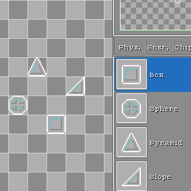
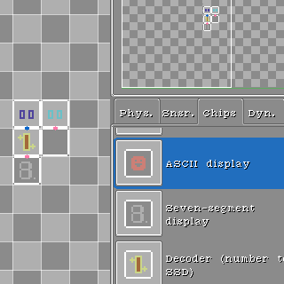
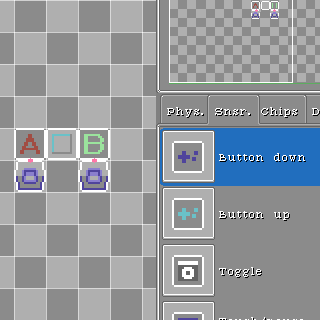
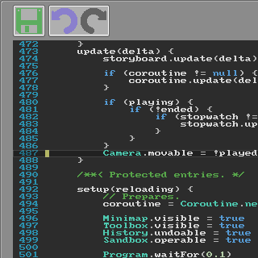
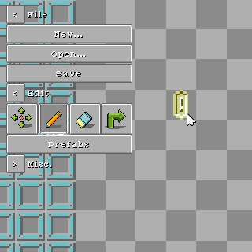

## Crafting

## Crafting

Craft framework of your machineries with physics elements.

Craft your circuit logic with chip elements.

Craft your input/output with sensor, dynamics elements

## Programming

Program your own disks.

## Sharing

Share your creativity with others.
