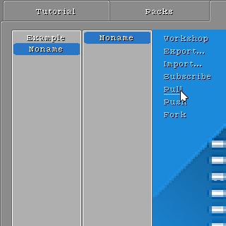

[简体中文](https://paladin-t.github.io/crft/docs/slides_cn)
[Homepage](https://paladin-t.github.io/crft/)

## Crafting

Craft the framework of your machineries with the physics elements.

Craft your circuit logic with the chip elements.

Craft your input/output with the sensor, dynamics elements.

## Programming

Program your own disks.

## Creating

Edit your scene with the built-in tools.

## Sharing

Share your creativity with others.
