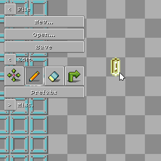
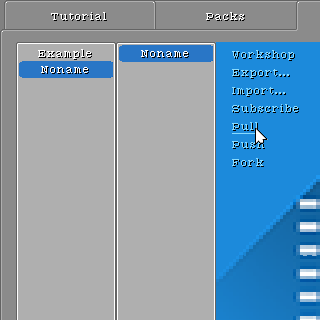

[English](https://paladin-t.github.io/crft/docs/slides) |
[首页](https://paladin-t.github.io/crft/README_cn)

## 搭建

使用物理元件搭建你的机器框架。

使用芯片元件搭建你的电路逻辑。

使用传感器、动力元件搭建你的输入、输出。

## 编程

通过编程创造你自己的磁盘。

## 创造

使用内置工具编辑你的场景。

## 分享

分享你的创意。
